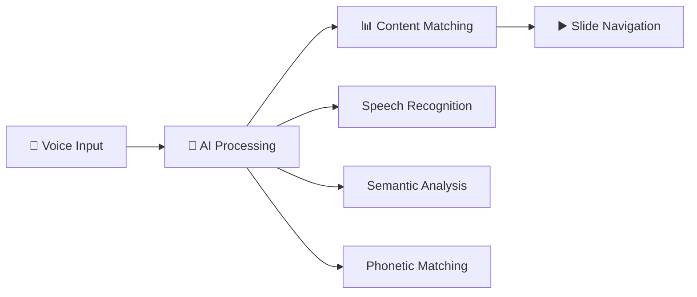

# Moves - AI-Powered Presentation Control System

<div align="center">


**Transform your presentations with intelligent voice-controlled navigation**

[](https://python.org)
[](https://opensource.org/licenses/MIT)
[](./docs/index.md)
[]()

[📚 Documentation](./docs/index.md) | [🚀 Quick Start](#quick-start) | [🏗️ Architecture](./docs/architecture.md) | [🤝 Contributing](./docs/development.md)

</div>

## 🌟 What is Moves?

**Moves** is an intelligent presentation control system that enables seamless slide navigation through voice commands. Using cutting-edge AI technologies including speech recognition, semantic understanding, and phonetic matching, Moves automatically detects what you're saying during a presentation and navigates to the appropriate slides in real-time.

### ✨ Key Features

- 🎤 **Voice-Controlled Navigation** - Automatically advance slides based on your spoken content
- 🤖 **AI-Powered Section Generation** - Process presentations and transcripts to create synchronized content sections  
- 🧠 **Dual Similarity Matching** - Combines semantic and phonetic similarity for robust voice recognition
- ⚡ **Real-time Audio Processing** - Low-latency speech recognition optimized for live presentations
- 👥 **Speaker Profile Management** - Manage multiple speakers and their presentation materials
- ⚙️ **Flexible Configuration** - Support for various LLM providers and customizable settings

## 🎯 How It Works



1. **📤 Content Processing**: Upload your presentation slides (PDF) and transcript (PDF)
2. **🤖 AI Section Generation**: The system uses LLM to align slide content with transcript segments
3. **🎤 Voice Recognition**: Real-time speech-to-text converts your spoken words
4. **🔍 Similarity Matching**: Compares spoken content against expected sections using both semantic and phonetic analysis
5. **🎯 Automatic Navigation**: Triggers slide transitions when content matches

## 🚀 Quick Start

### 1️⃣ Installation

```bash
# Clone the repository
git clone https://github.com/mdonmez/moves.git
cd moves

# Install dependencies (requires Python 3.13+)
pip install -r requirements.txt
```

### 2️⃣ Configuration

```bash
# Set your LLM model (supports OpenAI, Anthropic, Google, etc.)
python app.py settings set model "openai/gpt-4"

# Set your API key
python app.py settings set key "your-api-key-here"
```

### 3️⃣ Add a Speaker

```bash
# Add a new speaker with presentation and transcript files
python app.py speaker add "John Doe" presentation.pdf transcript.pdf
```

### 4️⃣ Process Speaker Data

```bash
# Generate synchronized sections using AI
python app.py speaker process "John Doe"
```

### 5️⃣ Start Live Control

```bash
# Begin voice-controlled presentation
python app.py presentation control "John Doe"
```

## 🏗️ System Architecture

<div align="center">

```
┌─────────────────┐    ┌──────────────────┐    ┌─────────────────┐
│   Speech Input  │───▶│ Presentation     │───▶│  Slide Output   │
│   (Microphone)  │    │ Controller       │    │  (Navigation)   │
└─────────────────┘    └──────────────────┘    └─────────────────┘
                                │
                       ┌────────┴────────┐
                       │                 │
            ┌──────────▼────────┐ ┌──────▼──────────┐
            │ Speech Recognition│ │ Similarity      │
            │ (Sherpa-ONNX)     │ │ Calculator      │
            └───────────────────┘ └─────────────────┘
                                          │
                                 ┌────────┴────────┐
                                 │                 │
                      ┌──────────▼────────┐ ┌──────▼────────┐
                      │ Semantic Engine   │ │ Phonetic      │
                      │ (Transformers)    │ │ Engine        │
                      └───────────────────┘ └───────────────┘
```

</div>

### 🧩 Core Components

- **[🎯 PresentationController](./docs/core-components.md#presentationcontroller)**: Main orchestrator for live presentation control
- **[👤 SpeakerManager](./docs/core-components.md#speakermanager)**: Handles speaker profiles and data management  
- **[🤖 SectionProducer](./docs/llm-integration.md#sectionproducer)**: AI-powered content synchronization
- **[🔍 SimilarityCalculator](./docs/similarity-system.md#similaritycalculator)**: Multi-modal content matching
- **[🎤 Speech Processing](./docs/speech-processing.md)**: Real-time audio analysis and recognition

## 💻 System Requirements

### Minimum Requirements
- **Python**: 3.13 or higher  
- **OS**: Windows 10+, macOS 10.14+, or Linux (Ubuntu 18.04+)
- **Memory**: 4GB RAM
- **Storage**: 2GB free disk space
- **Audio**: Microphone input device
- **Network**: Internet connection for LLM API calls

### Recommended Requirements  
- **Memory**: 8GB RAM or higher
- **Storage**: 5GB free disk space (for ML models and data)
- **Audio**: High-quality microphone for better recognition
- **Network**: Stable broadband connection

## 📚 Comprehensive Documentation

Our documentation is organized by audience and complexity:

### 🚀 For New Users
- **[Installation Guide](./docs/installation.md)** - Complete setup instructions and requirements
- **[User Guide](./docs/user-guide.md)** - Complete usage instructions and workflows  
- **[Configuration](./docs/configuration.md)** - Settings and customization options

### 🔧 For Developers & Technical Users
- **[Architecture Overview](./docs/architecture.md)** - System design and component interactions
- **[Core Components](./docs/core-components.md)** - Deep dive into main system components
- **[API Reference](./docs/api-reference.md)** - Detailed API documentation

### 🧠 For Technical Deep-Dives
- **[Similarity System](./docs/similarity-system.md)** - How content matching works
- **[Speech Processing](./docs/speech-processing.md)** - Audio processing and recognition
- **[LLM Integration](./docs/llm-integration.md)** - AI content processing and section generation

### 🆘 For Support & Contributing
- **[Troubleshooting](./docs/troubleshooting.md)** - Common issues and solutions
- **[Development Guide](./docs/development.md)** - Contributing and extending the system

> **📖 [Complete Documentation Index](./docs/index.md)** - Navigate all documentation with cross-references and reading paths

## 🌍 Supported LLM Providers

Moves integrates with multiple AI providers through LiteLLM:

| Provider | Models | Setup |
|----------|--------|--------|
| 🤖 **OpenAI** | GPT-4, GPT-3.5-turbo | `model: "openai/gpt-4"` |
| 🧠 **Anthropic** | Claude-3-sonnet, Claude-3-haiku | `model: "anthropic/claude-3-sonnet"` |  
| 🔍 **Google** | Gemini-2.0-flash, Gemini-pro | `model: "gemini/gemini-2.0-flash"` |
| ☁️ **Azure** | Azure OpenAI models | `model: "azure/gpt-4"` |
| 🚀 **AWS** | Bedrock models | `model: "bedrock/claude-3-sonnet"` |

## 🎬 Example Use Cases

### 📊 Technical Presentations
Perfect for technical talks, academic presentations, and conference presentations where precise terminology and timing matter.

### 🎓 Educational Content  
Great for lectures, training sessions, and educational workshops with structured content flow.

### 💼 Business Presentations
Ideal for sales presentations, board meetings, and client presentations requiring professional delivery.

### 🗣️ Multi-Speaker Events
Support for multiple speakers with individual profiles and presentation materials.

## 🤝 Contributing

We welcome contributions from the community! Here's how to get involved:

### 🐛 Bug Reports & Feature Requests
- Check [existing issues](https://github.com/mdonmez/moves/issues) first
- Create detailed bug reports with reproduction steps
- Suggest features with clear use cases

### 💻 Code Contributions
- Read our [Development Guide](./docs/development.md)
- Follow coding standards and testing practices
- Submit pull requests with clear descriptions

### 📖 Documentation
- Help improve documentation clarity
- Add examples and use cases
- Translate documentation

### 🧪 Testing & Feedback
- Test with different presentation types
- Report compatibility issues
- Share usage experiences

## 📜 License

This project is licensed under the MIT License - see the [LICENSE](LICENSE) file for details.

## 🙏 Acknowledgments

- **[Sherpa-ONNX](https://github.com/k2-fsa/sherpa-onnx)** for outstanding speech recognition capabilities
- **[LiteLLM](https://github.com/BerriAI/litellm)** for unified LLM provider access
- **[sentence-transformers](https://github.com/UKPLab/sentence-transformers)** for semantic similarity
- The open-source community for inspiration and tools

## 📞 Support & Community

- 📖 **[Documentation](./docs/index.md)** - Comprehensive guides and references
- 🐛 **[Issues](https://github.com/mdonmez/moves/issues)** - Bug reports and feature requests
- 💬 **[Discussions](https://github.com/mdonmez/moves/discussions)** - Community support and ideas
- 📧 **Email**: [Support](mailto:support@moves-project.org)

---

<div align="center">

**⭐ Star this repository if Moves helps you create amazing presentations! ⭐**

*Built with ❤️ for presenters who want to focus on their content, not their controls.*

</div>