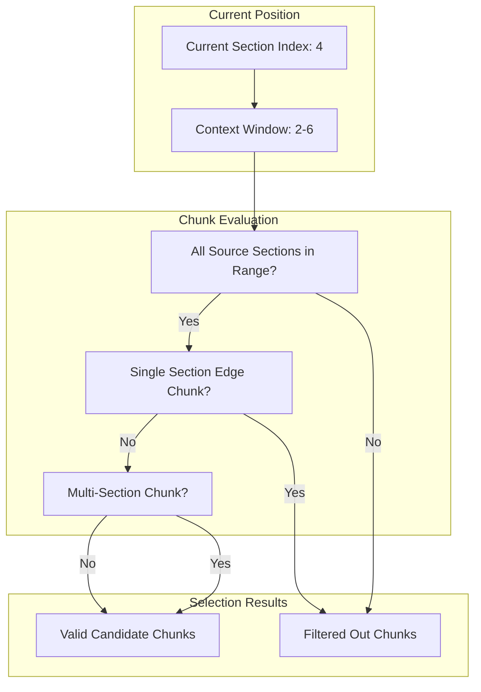

# Chunk-Based Text Segmentation

## Overview

The Chunk-Based Text Segmentation subsystem implements a sophisticated sliding window algorithm that transforms sequential presentation sections into overlapping text segments optimized for similarity matching and voice navigation. This architectural component bridges the gap between static content sections and dynamic real-time voice recognition, enabling accurate navigation through intelligent context preservation and boundary optimization.

## Chunking Architecture

### Core Chunking Algorithm

**Sliding Window Implementation**: Advanced text segmentation using configurable window sizes with multi-section attribution and context preservation.

```python
def generate_chunks(sections: list[Section], window_size: int = 12) -> list[Chunk]:
    words_with_sources = [
        (word, section) for section in sections for word in section.content.split()
    ]
    
    if len(words_with_sources) < window_size:
        return []

    return [
        Chunk(
            partial_content=text_normalizer.normalize_text(
                " ".join(word for word, _ in words_with_sources[i : i + window_size])
            ),
            source_sections=sorted(
                {section for _, section in words_with_sources[i : i + window_size]},
                key=lambda s: s.section_index,
            ),
        )
        for i in range(len(words_with_sources) - window_size + 1)
    ]
```

### Chunk Data Structure

**Immutable Chunk Design**: Frozen dataclass architecture ensuring data integrity with multi-section attribution.

```python
@dataclass(frozen=True)
class Chunk:
    partial_content: str
    source_sections: list["Section"]
```

**Design Benefits**:
- **Context Preservation**: Multiple source sections enable accurate navigation context
- **Immutability**: Frozen design prevents accidental modification during processing
- **Normalized Content**: Pre-processed text optimized for similarity calculations
- **Section Attribution**: Reverse lookup capability for navigation command generation

## Sliding Window Algorithm

### Window Configuration

**Optimal Window Sizing**: 12-word default window size based on empirical evaluation of speech recognition patterns and navigation accuracy.

```mermaid
graph TB
    subgraph "Section Content"
        A[Section 1: "the ability to say no"]
        B[Section 2: "have you ever struggled when you tried to say no"]
        C[Section 3: "or perhaps you couldnt say no to a person"]
    end
    
    subgraph "Word-Level Processing"
        D[Word Extraction with Section Attribution]
        E[Sequential Word-Section Pairs]
    end
    
    subgraph "Chunk Generation"
        F[12-Word Sliding Windows]
        G[Overlap Management]
        H[Multi-Section Chunks]
    end
    
    subgraph "Chunk Results"
        I[Chunk 1: "the ability to say no have you ever struggled"]
        J[Chunk 2: "ability to say no have you ever struggled when"]
        K[Chunk 3: "to say no have you ever struggled when you"]
    end
    
    A --> D
    B --> D  
    C --> D
    D --> E --> F --> G --> H
    F --> I
    G --> J
    H --> K
```

### Multi-Section Attribution

**Section Boundary Handling**: Intelligent management of chunks spanning multiple content sections.

**Attribution Benefits**:
- **Context Spanning**: Chunks can contain words from multiple adjacent sections
- **Navigation Accuracy**: Section attribution enables precise navigation target identification
- **Boundary Optimization**: Natural section transitions without artificial boundaries
- **Content Continuity**: Maintains semantic coherence across section boundaries

## Candidate Chunk Selection

### Context-Aware Selection

**Intelligent Candidate Filtering**: Advanced selection algorithm optimizing similarity calculation performance through context-aware chunk filtering.

```python
def get_candidate_chunks(current_section: Section, all_chunks: list[Chunk]) -> list[Chunk]:
    idx = int(current_section.section_index)
    start, end = idx - 2, idx + 3
    
    return [
        chunk for chunk in all_chunks
        if all(start <= int(s.section_index) <= end for s in chunk.source_sections)
        and not (
            len(chunk.source_sections) == 1
            and int(chunk.source_sections[0].section_index) in (start, end)
        )
    ]
```

**Selection Strategy**:
- **Local Context Window**: 5-section neighborhood (current ±2) for navigation relevance
- **Boundary Filtering**: Excludes single-section edge chunks for improved matching accuracy
- **Performance Optimization**: Reduced candidate set for faster similarity calculations
- **Navigation Logic**: Supports both forward and backward navigation patterns

### Filtering Logic

**Advanced Chunk Filtering**: Multi-criterion filtering to optimize matching accuracy and performance.



**Filtering Criteria**:
- **Range Validation**: All source sections must fall within the context window
- **Edge Exclusion**: Single-section chunks at window boundaries filtered out
- **Quality Assurance**: Multi-section chunks preferred for better context matching
- **Performance Balance**: Optimal candidate count for similarity calculation efficiency

## Text Normalization Integration

### Preprocessing Pipeline

**Integrated Normalization**: Seamless integration with text normalization pipeline for consistent similarity matching.

```python
partial_content=text_normalizer.normalize_text(
    " ".join(word for word, _ in words_with_sources[i : i + window_size])
)
```

**Normalization Benefits**:
- **Consistency**: Uniform text processing across all chunks
- **Matching Accuracy**: Improved similarity calculation through normalized content  
- **Performance**: Pre-normalized content reduces real-time processing overhead
- **Quality**: Enhanced matching robustness across different speech patterns

### Content Optimization

**Chunk Content Enhancement**: Advanced text processing optimized for voice recognition matching.

**Processing Features**:
- **Unicode Normalization**: NFC normalization for consistent character representation
- **Punctuation Handling**: Smart punctuation normalization preserving semantic meaning
- **Whitespace Optimization**: Consistent spacing for improved pattern matching
- **Case Normalization**: Lowercase conversion while preserving semantic content

## Performance Optimization

### Memory Efficiency

**Efficient Chunk Management**: Optimized memory usage through intelligent data structure design and lazy evaluation.

```python
# Memory-efficient chunk generation with generator pattern
def generate_chunks_lazy(sections: list[Section], window_size: int = 12):
    words_with_sources = [
        (word, section) for section in sections for word in section.content.split()
    ]
    
    for i in range(len(words_with_sources) - window_size + 1):
        yield Chunk(
            partial_content=text_normalizer.normalize_text(
                " ".join(word for word, _ in words_with_sources[i : i + window_size])
            ),
            source_sections=sorted(
                {section for _, section in words_with_sources[i : i + window_size]},
                key=lambda s: s.section_index,
            ),
        )
```

**Memory Features**:
- **Lazy Generation**: On-demand chunk creation reducing memory footprint
- **Object Reuse**: Efficient section reference sharing across chunks
- **Garbage Collection**: Optimized object lifecycle for memory reclamation
- **Batch Processing**: Efficient processing of large section collections

### Computational Efficiency

**Algorithm Optimization**: High-performance implementation with linear time complexity and minimal overhead.

**Performance Characteristics**:
- **Time Complexity**: O(n*w) where n is total words and w is window size
- **Space Complexity**: O(c) where c is number of generated chunks
- **Processing Speed**: Sub-millisecond chunk generation for typical presentations
- **Scalability**: Linear scaling with content size and configurable parameters

## Integration with Similarity Matching

### Seamless Pipeline Integration

**Direct Integration**: Optimized data flow between chunk generation and similarity calculation systems.

```python
# Typical usage pattern in PresentationController
self.chunks = chunk_producer.generate_chunks(sections, window_size)

# Real-time candidate selection
candidate_chunks = chunk_producer.get_candidate_chunks(
    current_section=self.current_section, 
    all_chunks=self.chunks
)

# Similarity calculation
results = self.similarity_calculator.compare(input_text, candidate_chunks)
```

**Integration Benefits**:
- **Type Safety**: Strong typing ensures data consistency between components
- **Performance**: Direct object passing without serialization overhead
- **Flexibility**: Configurable chunk parameters for different presentation types
- **Reliability**: Immutable data structures prevent processing corruption

### Navigation Context Preservation

**Context-Aware Navigation**: Chunk design optimized for accurate navigation command interpretation.

**Context Features**:
- **Section Mapping**: Direct mapping from chunks back to presentation sections
- **Boundary Awareness**: Intelligent handling of section transitions
- **Overlapping Windows**: Smooth navigation across content boundaries
- **Multi-Section Support**: Natural handling of content spanning multiple sections

## Advanced Chunking Strategies

### Adaptive Window Sizing

**Dynamic Window Configuration**: Context-sensitive window size adjustment based on content characteristics and performance metrics.

```python
class AdaptiveChunkProducer:
    def __init__(self):
        self.base_window_size = 12
        self.min_window_size = 8
        self.max_window_size = 16
    
    def adaptive_window_size(self, section_length: int, avg_word_length: float) -> int:
        # Adjust window size based on content characteristics
        if section_length < 20:  # Short sections
            return max(self.min_window_size, section_length // 2)
        elif avg_word_length > 7:  # Technical content
            return min(self.max_window_size, self.base_window_size + 2)
        else:
            return self.base_window_size
```

### Semantic Boundary Detection

**Intelligent Boundary Recognition**: Advanced algorithms for detecting natural semantic boundaries within content sections.

**Boundary Features**:
- **Topic Transitions**: Detection of topic changes within sections
- **Sentence Boundaries**: Respect for natural sentence structures
- **Phrase Groupings**: Semantic phrase preservation across chunk boundaries
- **Context Coherence**: Maintenance of semantic meaning within chunks

## Quality Assurance

### Chunk Validation

**Comprehensive Quality Control**: Multi-layer validation ensuring chunk quality and consistency.

```python
def validate_chunks(chunks: list[Chunk], original_sections: list[Section]) -> bool:
    # Validate chunk count and coverage
    if not chunks:
        raise ValueError("No chunks generated")
    
    # Validate section attribution
    all_referenced_sections = set()
    for chunk in chunks:
        all_referenced_sections.update(chunk.source_sections)
    
    original_sections_set = set(original_sections)
    if not all_referenced_sections.issubset(original_sections_set):
        raise ValueError("Chunks reference non-existent sections")
    
    # Validate content consistency
    for chunk in chunks:
        if not chunk.partial_content.strip():
            raise ValueError("Empty chunk content detected")
    
    return True
```

**Validation Criteria**:
- **Content Coverage**: All original sections represented in chunk collection
- **Reference Integrity**: All chunk section references point to valid sections
- **Content Quality**: No empty or malformed chunks
- **Index Consistency**: Proper section index ordering and continuity

### Performance Monitoring

**Continuous Performance Assessment**: Real-time monitoring of chunking performance and quality metrics.

**Monitoring Metrics**:
- **Generation Time**: Chunk creation performance tracking
- **Memory Usage**: Memory consumption monitoring and optimization
- **Match Accuracy**: Correlation between chunk quality and navigation success
- **Coverage Analysis**: Effectiveness of candidate selection algorithms

## Testing and Validation

### Unit Testing Framework

**Comprehensive Test Suite**: Extensive testing covering all chunking scenarios and edge cases.

**Test Categories**:
- **Algorithm Correctness**: Validation of sliding window implementation
- **Boundary Handling**: Testing of section boundary edge cases
- **Performance Benchmarks**: Scalability and efficiency validation
- **Integration Testing**: End-to-end pipeline validation with similarity matching

### Quality Benchmarks

**Standardized Quality Metrics**: Established benchmarks for chunk quality assessment and system optimization.

**Benchmark Categories**:
- **Navigation Accuracy**: Chunk contribution to navigation success rates
- **Processing Speed**: Performance benchmarks for different content sizes
- **Memory Efficiency**: Memory usage patterns and optimization validation
- **Content Coverage**: Completeness of content representation through chunks