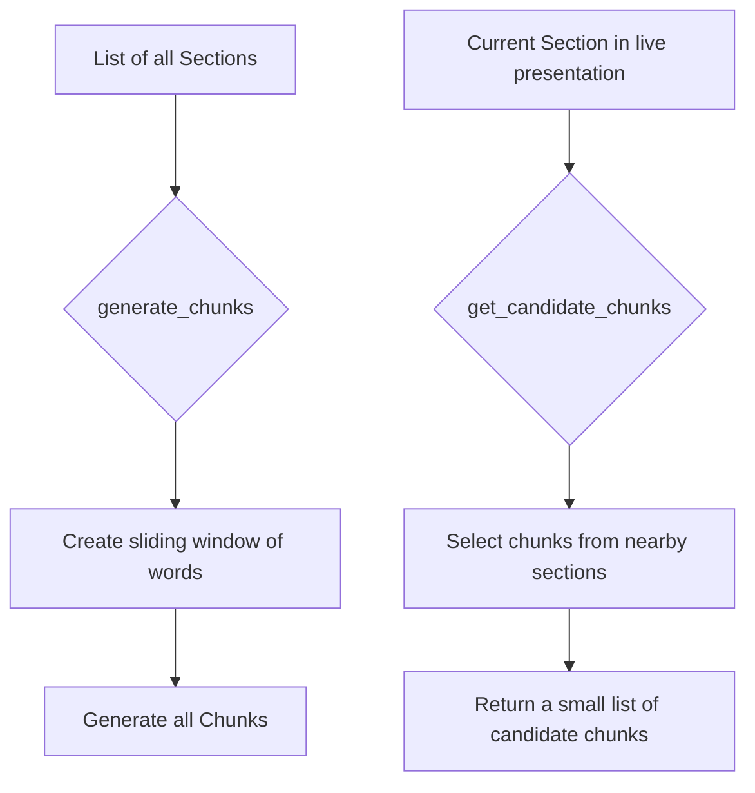

# Chunk Generation Approach

The `chunk_producer.py` module (`src/core/components/chunk_producer.py`) is responsible for breaking down the `Section` data into smaller, more manageable `Chunk` objects. These chunks are the units of comparison during the live presentation control.

## Chunk Generation

- **`generate_chunks`**: This function takes the list of all `Section` objects for a presentation and creates a series of overlapping text chunks. It does this by:
    1.  Creating a single list of all words from all sections, keeping track of which section each word came from.
    2.  Moving a sliding window (default size of 12 words) over this list.
    3.  For each position of the window, it creates a `Chunk` object containing the text within the window and a list of the unique source sections for those words.

## Candidate Chunk Selection

- **`get_candidate_chunks`**: During the live presentation, it would be inefficient to compare the speaker's current words against all possible chunks in the entire presentation. This function narrows down the search space by selecting only the most relevant chunks.
- It takes the `current_section` as input and selects chunks that are sourced from a small window of sections around the current one (e.g., two sections before and two sections after). This dramatically improves the performance and accuracy of the similarity comparison.

