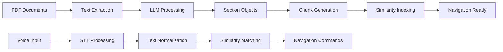

# Data Models - Core Domain Objects

## Overview

Moves employs a domain-driven design approach with immutable data structures, type safety, and clear separation of concerns. The data model architecture leverages Python's dataclass decorators with frozen attributes to ensure data integrity and predictable behavior across the application lifecycle.

## Core Domain Models

### Section

**Purpose**: Represents a discrete content segment derived from presentation slide and corresponding transcript narration.

```python
@dataclass(frozen=True)
class Section:
    content: str
    section_index: int
```

**Design Characteristics**:
- **Immutability**: Frozen dataclass prevents modification after instantiation
- **Sequential Indexing**: Zero-based indexing for consistent ordering and retrieval
- **Content Integrity**: String content preserves original transcript language and meaning
- **Serialization-Ready**: JSON-serializable for persistent storage and API communication

**Usage Patterns**:
- Generated through LLM-based content segmentation pipeline
- Consumed by chunk producer for sliding window text analysis
- Indexed for similarity-based retrieval during presentation control
- Persisted as JSON arrays in speaker profile storage

### Chunk

**Purpose**: Represents overlapping text segments created through sliding window analysis for similarity matching optimization.

```python
@dataclass(frozen=True)
class Chunk:
    partial_content: str
    source_sections: list["Section"]
```

**Advanced Features**:
- **Multi-Section Attribution**: Tracks all contributing sections for context preservation
- **Normalized Content**: Text undergoes linguistic normalization for improved matching accuracy
- **Window-Based Generation**: Configurable window size for granularity control
- **Context Preservation**: Maintains section boundaries for navigation accuracy

**Implementation Details**:
- Generated with default 12-word sliding windows
- Content normalization includes Unicode NFC, emoji removal, number conversion
- Source section references enable reverse lookup for navigation commands
- Immutable structure prevents accidental modification during similarity calculations

### Speaker

**Purpose**: Aggregate root representing a presentation speaker with associated content and metadata.

```python
@dataclass
class Speaker:
    name: str
    speaker_id: SpeakerId
    source_presentation: Path
    source_transcript: Path
```

**Domain Logic**:
- **Identity Management**: Unique speaker_id generated from name with collision detection
- **File Path Resolution**: Absolute path resolution with existence validation
- **Mutable Operations**: Supports updates to source files through edit operations
- **Persistence Strategy**: JSON serialization with Path-to-string conversion

**Business Rules**:
- Speaker names must be unique within the system
- Source files must exist and be readable PDF documents
- Speaker ID generation follows deterministic patterns for consistency
- Edit operations preserve existing processing results when possible

### SimilarityResult

**Purpose**: Encapsulates similarity calculation results with score and context information.

```python
@dataclass(frozen=True)
class SimilarityResult:
    chunk: Chunk
    score: float
```

**Scoring Characteristics**:
- **Normalized Scores**: Float values between 0.0 and 1.0 for consistent comparison
- **Chunk Attribution**: Direct reference to matched chunk for context retrieval
- **Comparison Support**: Natural ordering by score for result ranking
- **Immutable Results**: Prevents score manipulation after calculation

**Usage in Similarity Pipeline**:
- Generated by semantic and phonetic similarity calculators
- Combined through weighted scoring algorithms
- Sorted for best-match identification
- Consumed by presentation navigation logic

### Settings

**Purpose**: Configuration aggregate managing system-wide parameters and user preferences.

```python
@dataclass
class Settings:
    model: str
    key: str
```

**Configuration Management**:
- **LLM Model Selection**: Supports multiple providers through LiteLLM abstraction
- **API Key Management**: Secure credential storage with encryption support
- **Template-Based Defaults**: Hierarchical configuration with user overrides
- **Runtime Validation**: Type checking and constraint validation

**Supported Models**:
- Google Gemini variants (gemini-2.0-flash, gemini-2.5-flash)
- OpenAI GPT models with structured output support
- Anthropic Claude models through LiteLLM integration
- Custom provider endpoints with API key authentication

### ProcessResult

**Purpose**: Represents the outcome of speaker processing operations with metadata and status information.

```python
@dataclass(frozen=True)
class ProcessResult:
    section_count: int
    transcript_from: Literal["SOURCE", "LOCAL"]
    presentation_from: Literal["SOURCE", "LOCAL"]
```

**Operational Metadata**:
- **Section Count**: Number of generated sections for processing validation
- **File Source Tracking**: Distinguishes between original files and local copies
- **Processing Status**: Immutable record of processing outcomes
- **Audit Trail**: Enables troubleshooting and process optimization

## Type Definitions

### Custom Type Aliases

```python
SpeakerId = str
HistoryId = str
```

**Type Safety Benefits**:
- **Semantic Clarity**: Distinguishes string purposes in function signatures
- **IDE Support**: Enhanced autocomplete and type checking
- **Refactoring Safety**: Centralized type definitions for system-wide changes
- **Documentation Value**: Self-documenting code through expressive type names

## Data Validation and Constraints

### Pydantic Integration

**LLM Response Validation**:
```python
class SectionsOutputModel(BaseModel):
    class SectionItem(BaseModel):
        section_index: int = Field(..., ge=0, description="Index starting from 0")
        content: str = Field(..., description="Content of the section")

    sections: list[SectionItem] = Field(
        ...,
        description="List of section items, one for each slide",
        min_items=len(presentation_data.split("\n\n")),
        max_items=len(presentation_data.split("\n\n")),
    )
```

**Validation Rules**:
- Section indices must be non-negative integers
- Content strings cannot be empty
- Section count must match presentation slide count exactly
- Field descriptions provide clear context for LLM generation

## Data Flow Architecture

### Persistence Strategy

**File System Organization**:
```
~/.moves/
├── speakers/
│   └── {speaker_id}/
│       ├── speaker.json          # Speaker metadata
│       ├── sections.json         # Section[] serialization
│       ├── presentation.pdf      # Local copy (optional)
│       └── transcript.pdf        # Local copy (optional)
└── settings.yaml                 # Settings serialization
```

**Serialization Patterns**:
- **JSON for Structured Data**: Speakers and sections use JSON for cross-platform compatibility
- **YAML for Configuration**: Settings use YAML for human readability and comments
- **Atomic Operations**: File writes use temporary files with atomic moves
- **Error Recovery**: Backup mechanisms for critical data corruption scenarios

### Data Transformation Pipeline



**Transformation Characteristics**:
- **Immutable Transformations**: Each stage produces new immutable objects
- **Type-Safe Pipelines**: Strong typing prevents data corruption between stages
- **Error Boundaries**: Each transformation stage includes error handling and recovery
- **Parallel Processing**: Independent speakers can be processed concurrently

## Performance Considerations

### Memory Optimization

**Object Lifecycle Management**:
- Frozen dataclasses reduce memory overhead through object interning
- Section objects are created once and referenced by multiple chunks
- Similarity results are short-lived and garbage collected after navigation
- Speaker objects persist for the application lifecycle

**Caching Strategies**:
- LRU cache for phonetic code generation (350 entry limit)
- Embedding cache for repeated similarity calculations  
- File system cache for speaker metadata with lazy loading
- Configuration cache with change detection and invalidation

### Scalability Patterns

**Data Structure Selection**:
- Lists for ordered sequences with index-based access patterns
- Deques for FIFO audio processing queues with bounded size
- Dictionaries for fast lookups in similarity score normalization
- Sets for unique section identification in chunk generation

**Concurrent Access Patterns**:
- Read-only access to frozen data structures enables lock-free operations
- Mutable speaker objects require coordination during edit operations
- File system operations use atomic patterns to prevent corruption
- Audio processing uses lock-free queues for real-time performance