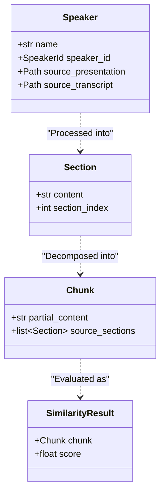

# Data Models & Structures

The application's data integrity is maintained through a set of Pydantic models defined in `src/data/models.py`. These models serve as formal definitions for the data structures used throughout the system.

## Core Data Structures

- **`Speaker`**: Represents a speaker's profile. It encapsulates the speaker's `name`, a unique `speaker_id`, and the absolute file paths (`source_presentation`, `source_transcript`) to their source materials. This object is the primary entity for all speaker-related operations.

- **`Settings`**: A model representing the application's configuration, loaded from `settings.yaml`. It holds the `model` (the identifier for the LLM to be used, e.g., `gemini/gemini-pro`) and the `key` for the corresponding service.

- **`Section`**: A fundamental data structure representing a logical segment of the presentation, corresponding to a single slide. It contains the `content` (a string of text from the transcript that aligns with the slide's topic) and the `section_index` (a zero-based integer).

- **`Chunk`**: The atomic unit for similarity comparison. A `Chunk` is a small, overlapping snippet of text generated from one or more `Sections`. It contains `partial_content` (a normalized string of a fixed number of words, e.g., 12) and `source_sections` (a list of the `Section` objects from which the content was derived). This structure allows the system to match a small fragment of speech to a specific point in the presentation.

## Supporting Data Structures

- **`SimilarityResult`**: A transient data object used to encapsulate the outcome of a similarity comparison. It holds a reference to the `Chunk` that was compared and the resulting `score` (a float between 0.0 and 1.0).

- **`ProcessResult`**: Contains metadata about a completed speaker processing job. It includes the total `section_count` and indicates whether the `transcript_from` and `presentation_from` were from the original `SOURCE` files or from the `LOCAL` cache.

## Type Aliases

To improve code clarity and enforce type consistency, the following type aliases are defined:

- **`SpeakerId`**: An alias for `str`, representing the unique, URL-safe identifier generated for each speaker (e.g., `john-doe-aB1cD`).

- **`HistoryId`**: An alias for `str`, representing a unique, timestamp-based identifier for a presentation control session (e.g., `20250827_10-30-00`).

