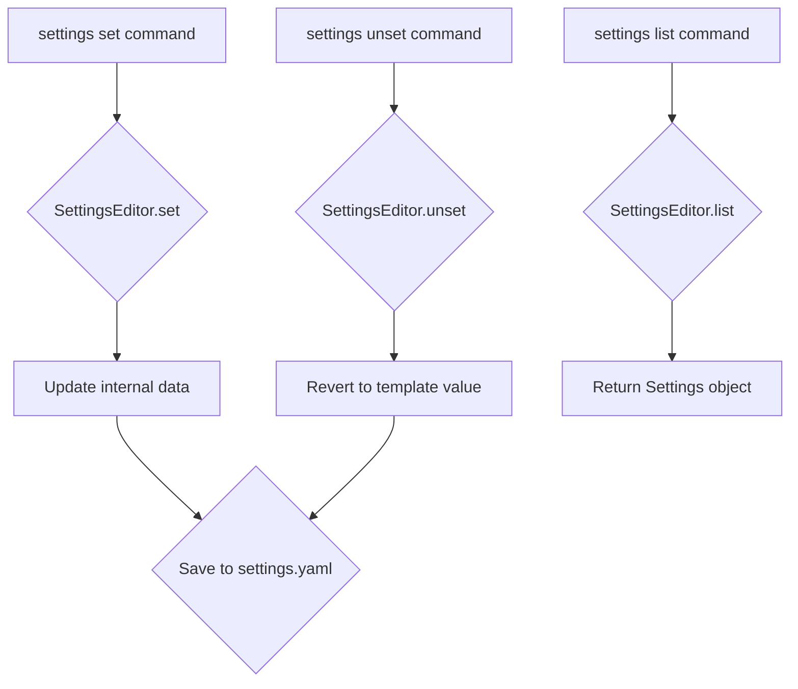

# Editing Settings

The `SettingsEditor` class, found in `src/core/settings_editor.py`, provides a straightforward way to manage the application's configuration. It handles reading from and writing to a `settings.yaml` file located in the user's home directory (`.moves/`).

## Functionality

- **Initialization**: When instantiated, the `SettingsEditor` loads a template (`settings_template.yaml`) and merges it with the user's existing settings. This ensures that all required settings are present.
- **Setting a Value**: The `set` method allows updating a specific setting by key and value.
- **Unsetting a Value**: The `unset` method reverts a setting to its default value as defined in the template.
- **Listing Settings**: The `list` method returns a `Settings` object containing the current configuration.

## Configuration File

The `settings.yaml` file stores the configuration. The `settings_template.yaml` provides the default values for the model and API key.

