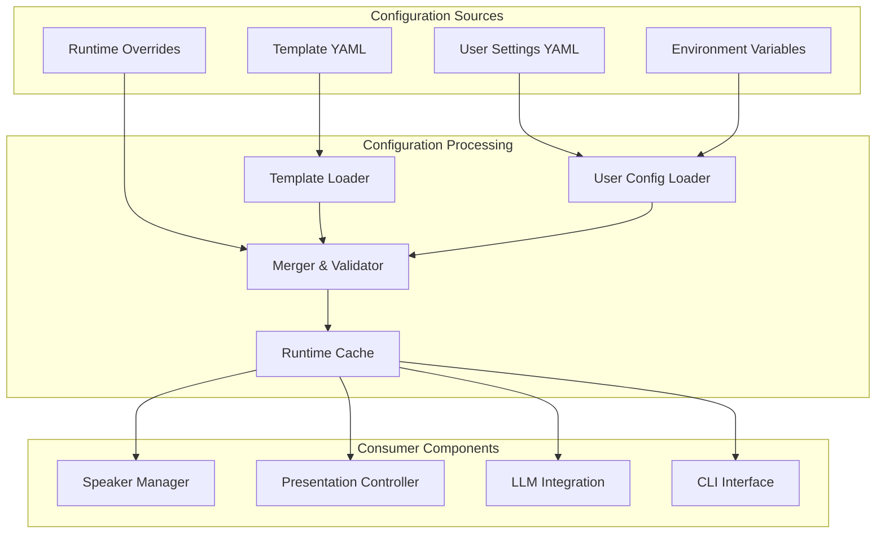

# Settings Management - Configuration Architecture

## Overview

The Settings Management subsystem implements a sophisticated hierarchical configuration architecture that combines template-driven defaults, user-specific overrides, and runtime optimization. The system provides type-safe configuration management with atomic updates, validation frameworks, and seamless integration across all system components.

## Architecture Design

### Configuration Hierarchy

**Three-Layer Architecture**:
1. **Template Layer**: System defaults with type constraints and validation rules
2. **User Layer**: Persistent overrides with YAML serialization and version control
3. **Runtime Layer**: In-memory cache with lazy loading and change detection



### SettingsEditor Class

**Core Architecture**:
```python
class SettingsEditor:
    template = Path("src/data/settings_template.yaml")
    settings = data_handler.DATA_FOLDER / Path("settings.yaml")
    
    def __init__(self):
        self.template_data = yaml.load(self.template.read_text(encoding="utf-8")) or {}
        user_data = yaml.load(data_handler.read(self.settings)) or {}
        self._data = {**self.template_data, **user_data}
        self._save()
```

**Key Methods**:
- `list() -> Settings`: Retrieve current configuration with template merging
- `set(key: str, value: str) -> bool`: Update configuration with validation
- `unset(key: str) -> bool`: Reset setting to template default
- `_save() -> None`: Atomic persistence with consistency guarantees

## Configuration Management

### Template-Driven Defaults

**Template Structure**:
```yaml
# src/data/settings_template.yaml
model: "gemini/gemini-2.0-flash"
key: null

# Optional metadata
_metadata:
  version: "1.0"
  last_updated: "2024-01-01"
  supported_models:
    - "gemini/gemini-2.0-flash"
    - "gemini/gemini-2.5-flash"
    - "gpt-4"
    - "gpt-3.5-turbo"
```

**Template Benefits**:
- **Default Value Management**: Centralized default configuration with versioning
- **Type Constraints**: Schema validation through YAML structure definition
- **Documentation Integration**: Inline comments for configuration guidance
- **Migration Support**: Version tracking for configuration upgrades

### User Configuration Overrides

**User Settings Architecture**:
```yaml
# ~/.moves/settings.yaml
model: "gpt-4"
key: "sk-xxxxxxxxxxxxxxxxxxxxx"

# User-specific extensions
preferences:
  audio_threshold: 0.7
  similarity_weights:
    semantic: 0.4
    phonetic: 0.6
```

**Override Mechanics**:
- **Selective Overrides**: Users modify only required settings
- **Template Preservation**: Default values maintained for unmodified settings
- **Validation Inheritance**: Template constraints applied to user values
- **Atomic Updates**: Configuration changes applied atomically with rollback

### Runtime Configuration Cache

**Caching Strategy**:
```python
def _save(self):
    self.settings.parent.mkdir(parents=True, exist_ok=True)
    node = copy.deepcopy(self.template_data) if isinstance(self.template_data, dict) else {}
    
    for key in node.keys():
        if key in self._data:
            node[key] = self._data[key]
    
    with self.settings.open("w", encoding="utf-8") as f:
        yaml.dump(node, f, default_flow_style=False)
```

**Cache Features**:
- **Lazy Loading**: Configuration loaded on first access with persistent caching
- **Change Detection**: Automatic cache invalidation based on file modification
- **Memory Optimization**: Minimal memory footprint with structured object reuse
- **Thread Safety**: Read-optimized with write coordination for concurrent access

## Configuration Operations

### Set Operation

**Functionality**: Updates configuration values with comprehensive validation and atomic persistence.

**Implementation Flow**:
1. **Input Validation**: Type checking and constraint validation against template schema
2. **Value Transformation**: String normalization and type coercion where appropriate  
3. **Cache Update**: In-memory configuration update with change tracking
4. **Persistence**: Atomic YAML write with backup creation and rollback capability
5. **Notification**: Change notification to dependent components for cache refresh

**Validation Rules**:
```python
def set(self, key: str, value: str) -> bool:
    if key not in self.template_data:
        raise KeyError(f"Unknown setting: {key}")
    
    if key == "model":
        if value not in SUPPORTED_MODELS:
            raise ValueError(f"Unsupported model: {value}")
    
    if key == "key":
        if not value or len(value) < 10:
            raise ValueError("API key must be at least 10 characters")
    
    self._data[key] = value
    self._save()
    return True
```

### Unset Operation

**Functionality**: Resets configuration values to template defaults with validation and cleanup.

**Reset Logic**:
- **Template Lookup**: Retrieve default value from template configuration
- **Validation**: Ensure reset value meets current system constraints
- **Cache Invalidation**: Clear cached values and trigger reload from template
- **Persistence**: Update user configuration to remove override entries

### List Operation

**Functionality**: Provides comprehensive configuration view with source attribution and validation status.

**Enhanced Reporting**:
```python
def list(self) -> Settings:
    settings = Settings(
        model=self._data.get("model", "Not configured"),
        key=self._data.get("key", "Not configured")
    )
    
    # Include metadata for debugging and troubleshooting
    if hasattr(self, '_metadata'):
        settings._source_info = {
            'model': 'template' if self._data.get("model") == self.template_data.get("model") else 'user',
            'key': 'user' if self._data.get("key") else 'not_set'
        }
    
    return settings
```

## Advanced Configuration Features

### Environment Variable Integration

**Environment Override Support**:
```python
def _load_with_env_override(self):
    config = copy.deepcopy(self._data)
    
    # Environment variable mapping
    env_mapping = {
        'MOVES_LLM_MODEL': 'model',
        'MOVES_API_KEY': 'key',
        'MOVES_AUDIO_THRESHOLD': 'audio_threshold'
    }
    
    for env_var, config_key in env_mapping.items():
        if env_value := os.getenv(env_var):
            config[config_key] = env_value
    
    return config
```

**Environment Benefits**:
- **Container Support**: Docker and Kubernetes configuration through environment variables
- **CI/CD Integration**: Build pipeline configuration without file modification
- **Security Enhancement**: Sensitive values through environment without file storage
- **Development Workflow**: Developer-specific configuration without version control conflicts

### Configuration Validation Framework

**Schema Validation**:
```python
class SettingsSchema(BaseModel):
    model: str = Field(..., regex=r'^(gemini|gpt|claude).*')
    key: Optional[str] = Field(None, min_length=10)
    
    class Config:
        extra = "forbid"  # Prevent unknown configuration keys
        
    @validator('model')
    def validate_model(cls, v):
        supported_providers = ['gemini', 'openai', 'anthropic']
        if not any(v.startswith(provider) for provider in supported_providers):
            raise ValueError(f'Model must start with one of: {supported_providers}')
        return v
```

**Validation Features**:
- **Type Safety**: Strong typing with runtime validation
- **Constraint Enforcement**: Business rule validation with custom validators
- **Schema Evolution**: Version-aware validation for configuration migration
- **Error Reporting**: Detailed validation errors with correction suggestions

### Configuration Migration

**Version Management**:
```python
def migrate_config(self, current_version: str, target_version: str):
    migrations = {
        "1.0_to_1.1": self._migrate_v1_0_to_v1_1,
        "1.1_to_1.2": self._migrate_v1_1_to_v1_2
    }
    
    migration_key = f"{current_version}_to_{target_version}"
    if migration_func := migrations.get(migration_key):
        backup_path = self.settings.with_suffix(f".backup.{current_version}")
        shutil.copy(self.settings, backup_path)
        migration_func()
        self._save()
```

**Migration Capabilities**:
- **Backward Compatibility**: Support for legacy configuration formats
- **Automatic Migration**: Seamless upgrade during application startup
- **Backup Creation**: Configuration backups before migration with rollback support
- **Validation Integration**: Post-migration validation to ensure configuration integrity

## Integration Patterns

### Component Integration

**Configuration Consumer Pattern**:
```python
class ConfigurationConsumer:
    def __init__(self):
        self.settings_editor = SettingsEditor()
        self.config = self.settings_editor.list()
        self._register_config_listener()
    
    def _register_config_listener(self):
        # Register for configuration change notifications
        config_manager.subscribe(self._on_config_change)
    
    def _on_config_change(self, changed_keys: set[str]):
        self.config = self.settings_editor.list()
        self._apply_configuration_changes(changed_keys)
```

**Integration Benefits**:
- **Loose Coupling**: Components depend on configuration interface, not implementation
- **Change Reactivity**: Automatic reconfiguration without application restart
- **Testing Support**: Easy configuration mocking and testing
- **Performance Optimization**: Change notification prevents unnecessary polling

### CLI Integration

**Command-Line Configuration Management**:
```python
@settings_app.command("set")
def settings_set(key: str, value: str):
    try:
        settings_editor = settings_editor_instance()
        result = settings_editor.set(key, value)
        
        if result:
            typer.echo(f"Setting '{key}' updated successfully.")
        else:
            typer.echo(f"Failed to update setting '{key}'.", err=True)
            
    except ValueError as e:
        typer.echo(f"Validation error: {str(e)}", err=True)
        raise typer.Exit(1)
```

## Security and Privacy

### Credential Management

**API Key Security**:
- **File Permissions**: Restricted file permissions on configuration files (600)
- **Environment Variables**: Support for external credential management
- **Encryption at Rest**: Optional encryption for sensitive configuration values
- **Audit Logging**: Configuration access and modification logging

### Privacy Considerations

**Data Protection**:
- **Local Storage**: All configuration stored locally without external transmission
- **Minimal Data Collection**: Only essential configuration data collected and stored
- **User Control**: Complete user control over configuration data and removal
- **No Telemetry**: Configuration usage not transmitted to external services

## Performance Optimization

### Efficient Configuration Access

**Access Patterns**:
- **Lazy Loading**: Configuration loaded only when required
- **Caching Strategy**: Intelligent caching with TTL and invalidation
- **Memory Footprint**: Minimal memory usage through object sharing
- **I/O Optimization**: Batched file operations and atomic updates

### Configuration Change Performance

**Update Optimization**:
- **Incremental Updates**: Only modified values written to storage
- **Batch Operations**: Multiple configuration changes applied atomically
- **Validation Caching**: Validation results cached to prevent repeated computation
- **Change Notification**: Efficient change propagation to dependent components