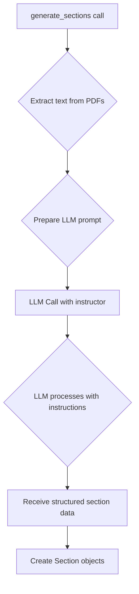

# Section Generation Approach

The `section_producer.py` module (`src/core/components/section_producer.py`) is responsible for the intelligent processing of a speaker's presentation and transcript to create the `Section` data used for live navigation.

## The Process

1.  **PDF Extraction**: The `generate_sections` function begins by extracting the text content from both the presentation and transcript PDF files. The presentation is converted into a Markdown-like format, with each slide represented as a separate section.
2.  **LLM Interaction**: The extracted presentation text and the full transcript are then sent to a large language model (LLM). The interaction is guided by a detailed system prompt located in `src/data/llm_instruction.md`.
3.  **System Prompt**: This prompt instructs the LLM to generate one text segment for each slide of the presentation, using the transcript as the authoritative source for content and language. It specifically tells the model to match the topic of each slide to the relevant part of the transcript.
4.  **Response Model**: The application uses the `instructor` library to structure the LLM's response, ensuring that the output is a list of sections in the correct format.
5.  **Section Creation**: The content returned by the LLM is used to create a list of `Section` objects, each with its corresponding index.

## LLM Instructions

The `llm_instruction.md` file is crucial to the success of the section generation. It enforces strict rules that the LLM must follow, such as:

- The number of generated sections must exactly match the number of slides.
- The transcript is the single source of truth for content and language.
- The LLM should disregard non-substantive information from the slides.
- If a topic from a slide is not present in the transcript, the LLM should synthesize a concise sentence in the speaker's style.

