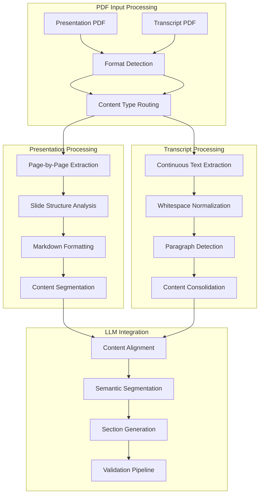

# Section-Based Content Processing

## Overview

The Section-Based Content Processing subsystem implements the core artificial intelligence pipeline that transforms raw PDF presentations and transcripts into structured, semantically-aware content sections optimized for real-time voice navigation. This sophisticated system combines advanced PDF parsing, large language model integration, and structured data validation to create the foundational content architecture for the entire presentation control system.

## Processing Architecture

### Section Producer Component

**Primary Responsibilities**:
- **Multi-format PDF text extraction** with content type-specific processing strategies
- **LLM-powered content segmentation** using instructor-enhanced structured output generation  
- **Section validation and indexing** with consistency guarantees and error recovery
- **Data serialization and persistence** with atomic operations and backup mechanisms

```python
class SectionProducer:
    @staticmethod
    def generate_sections(presentation_path: Path, transcript_path: Path, llm_model: str, llm_api_key: str) -> list[Section]:
        presentation_data = _extract_pdf(presentation_path, "presentation")
        transcript_data = _extract_pdf(transcript_path, "transcript")
        
        section_contents = _call_llm(
            presentation_data=presentation_data,
            transcript_data=transcript_data,
            llm_model=llm_model,
            llm_api_key=llm_api_key,
        )
        
        generated_sections = []
        for idx, content in enumerate(section_contents):
            section = Section(content=content, section_index=idx)
            generated_sections.append(section)
        
        return generated_sections
```

### Content Extraction Pipeline

**Dual-Mode PDF Processing**: Specialized extraction strategies optimized for presentation slides versus continuous transcript content.



## PDF Text Extraction

### Presentation Mode Processing

**Slide-Centric Extraction**: Page-by-page processing with markdown structure preservation for optimal LLM comprehension.

```python
def _extract_pdf(pdf_path: Path, extraction_type: Literal["transcript", "presentation"]) -> str:
    try:
        with pymupdf.open(pdf_path) as doc:
            match extraction_type:
                case "presentation":
                    markdown_sections = []
                    slide_count = 0
                    for i, page in enumerate(doc):
                        page_text = page.get_text("text")
                        cleaned_text = " ".join(page_text.split())
                        markdown_sections.append(f"# Slide Page {i}\n{cleaned_text}")
                        slide_count += 1
                    return "\n\n".join(markdown_sections)
```

**Presentation Processing Features**:
- **Slide Boundary Detection**: Clear delineation between presentation slides
- **Header Structure**: Markdown headers for improved LLM slide understanding
- **Content Cleaning**: Removal of OCR artifacts and formatting inconsistencies
- **Index Preservation**: Maintain slide ordering for section index mapping

### Transcript Mode Processing  

**Continuous Text Extraction**: Unified text flow processing with normalization for natural language comprehension.

```python
case "transcript":
    full_text = "".join(page.get_text("text") for page in doc)
    result = " ".join(full_text.split())
    return result
```

**Transcript Processing Features**:
- **Flow Preservation**: Maintain natural speech flow across page boundaries
- **Whitespace Normalization**: Consistent spacing for improved text processing
- **Content Consolidation**: Single text block for coherent narrative processing
- **OCR Error Mitigation**: Robust handling of text recognition inconsistencies

## Large Language Model Integration

### Structured Output Generation

**Instructor-Enhanced Processing**: Pydantic model validation with JSON mode for reliable structured output generation.

```python
def _call_llm(presentation_data: str, transcript_data: str, llm_model: str, llm_api_key: str) -> list[str]:
    class SectionsOutputModel(BaseModel):
        class SectionItem(BaseModel):
            section_index: int = Field(..., ge=0, description="Index starting from 0")
            content: str = Field(..., description="Content of the section")

        sections: list[SectionItem] = Field(
            ...,
            description="List of section items, one for each slide",
            min_items=len(presentation_data.split("\n\n")),
            max_items=len(presentation_data.split("\n\n")),
        )
    
    try:
        system_prompt = Path("src/data/llm_instruction.md").read_text(encoding="utf-8")
        client = instructor.from_litellm(completion, mode=instructor.Mode.JSON)

        response = client.chat.completions.create(
            model=llm_model,
            api_key=llm_api_key,
            messages=[
                {"role": "system", "content": system_prompt},
                {"role": "user", "content": f"Presentation: {presentation_data}\nTranscript: {transcript_data}"},
            ],
            response_model=SectionsOutputModel,
            temperature=0.2,
        )
        
        return [item.content for item in response.sections]
```

### LLM Prompt Engineering

**Specialized Instruction Design**: Domain-specific prompts optimized for presentation content alignment and section generation.

**Prompt Architecture Components**:
- **Task Definition**: Clear specification of content alignment objectives
- **Input Format Description**: Detailed explanation of presentation and transcript data structures
- **Output Constraints**: Strict requirements for section count matching and content quality
- **Quality Guidelines**: Criteria for content selection and language preservation

**Key Instruction Principles**:
```markdown
Your primary function is to align presentation data with a speaker's transcript. 
You will process two inputs to generate a series of text segments.

Your single objective is to produce one text segment for each slide provided. 
Each segment must represent the speaker's narration corresponding to that specific slide's topic.
```

### Response Validation Framework

**Multi-Layer Validation**: Comprehensive validation pipeline ensuring output quality and consistency.

**Validation Layers**:
- **Pydantic Model Validation**: Type checking and field constraint enforcement
- **Section Count Verification**: Exact match between generated sections and presentation slides
- **Content Quality Assessment**: Empty section detection and content richness evaluation
- **Index Consistency Checking**: Sequential ordering validation with gap detection

## Content Segmentation Strategy

### Slide-to-Transcript Alignment

**Semantic Matching Algorithm**: Intelligent content alignment based on topical coherence and contextual similarity.

**Alignment Process**:
1. **Topic Extraction**: Identify key topics and themes from presentation slides
2. **Transcript Segmentation**: Locate relevant transcript passages for each topic
3. **Content Mapping**: Create one-to-one mapping between slides and transcript segments
4. **Quality Validation**: Ensure content coherence and completeness for each section

### Content Generation Hierarchy

**Fallback Strategy**: Multi-tiered approach ensuring complete section coverage even with partial transcript alignment.

**Generation Tiers**:
1. **Direct Extraction**: Primary method extracting relevant transcript passages
2. **Content Condensation**: Minor editing to improve focus while preserving meaning
3. **Synthesis Generation**: Fallback synthesis for missing content (rare cases)
4. **Quality Assurance**: Validation ensuring seamless integration with speaker's style

## Section Data Management

### Section Object Architecture

**Immutable Data Structure**: Frozen dataclass design ensuring data integrity throughout processing pipeline.

```python
@dataclass(frozen=True)
class Section:
    content: str
    section_index: int
```

**Design Benefits**:
- **Immutability**: Prevents accidental modification after creation
- **Type Safety**: Strong typing for compile-time error detection
- **Serialization**: Direct JSON serialization support for persistence
- **Performance**: Reduced memory overhead through object interning

### Serialization and Persistence

**Conversion Utilities**: Efficient conversion between object and serializable formats.

```python
def convert_to_list(section_objects: list[Section]) -> list[dict[str, str | int]]:
    return [{"content": s.content, "section_index": s.section_index} for s in section_objects]

def convert_to_objects(section_list: list[dict[str, str | int]]) -> list[Section]:
    return [Section(content=item["content"], section_index=item["section_index"]) for item in section_list]
```

**Persistence Features**:
- **JSON Compatibility**: Direct conversion to JSON-serializable dictionaries
- **Version Compatibility**: Forward and backward compatible serialization formats
- **Compression Support**: Optional compression for large section collections
- **Atomic Operations**: Consistent write operations with rollback capability

## Error Handling and Recovery

### Processing Validation

**Comprehensive Error Detection**: Multi-stage validation with detailed error reporting and recovery suggestions.

```python
def generate_sections(presentation_path: Path, transcript_path: Path, llm_model: str, llm_api_key: str) -> list[Section]:
    try:
        presentation_data = _extract_pdf(presentation_path, "presentation")
        transcript_data = _extract_pdf(transcript_path, "transcript")
        
        if not presentation_data.strip():
            raise ValueError(f"No content extracted from presentation: {presentation_path}")
        
        if not transcript_data.strip():
            raise ValueError(f"No content extracted from transcript: {transcript_path}")
        
        section_contents = _call_llm(presentation_data, transcript_data, llm_model, llm_api_key)
        
        if not section_contents:
            raise ValueError("LLM returned no section content")
        
        expected_count = len(presentation_data.split("\n\n"))
        if len(section_contents) != expected_count:
            raise ValueError(f"Section count mismatch: expected {expected_count}, got {len(section_contents)}")
        
        return [Section(content=content, section_index=idx) for idx, content in enumerate(section_contents)]
        
    except Exception as e:
        raise RuntimeError(f"Section generation failed: {e}") from e
```

### Recovery Mechanisms

**Graceful Degradation**: Fallback strategies ensuring partial success when possible.

**Recovery Strategies**:
- **Partial Processing**: Save successful sections when partial failures occur
- **Retry Logic**: Automatic retry with exponential backoff for transient failures
- **Alternative Models**: Fallback to different LLM models when primary model fails
- **Manual Intervention**: Clear error messages with actionable recovery steps

## Performance Optimization

### Processing Efficiency

**Optimized Processing Pipeline**: Efficient resource utilization with minimal memory overhead.

**Optimization Features**:
- **Streaming Processing**: Process large documents without loading entirely into memory
- **Parallel Processing**: Concurrent section generation when processing multiple speakers
- **Caching**: Cache extracted content for repeated processing operations
- **Memory Management**: Efficient object lifecycle management for large datasets

### LLM Integration Optimization

**API Efficiency**: Optimized LLM usage with cost and latency optimization.

**Integration Features**:
- **Batch Processing**: Process multiple speakers in optimized batches when possible
- **Response Caching**: Cache responses for identical input combinations
- **Token Optimization**: Minimize token usage through efficient prompt design
- **Rate Limiting**: Intelligent request pacing to respect API quotas

## Integration with System Components

### Speaker Management Integration

**Seamless Pipeline Integration**: Direct integration with speaker processing workflow.

```python
# Called from SpeakerManager.process()
sections = await asyncio.to_thread(
    section_producer.generate_sections,
    presentation_path=presentation_path,
    transcript_path=transcript_path,
    llm_model=llm_model,
    llm_api_key=llm_api_key,
)
```

### Chunk Producer Integration

**Section-to-Chunk Pipeline**: Generated sections feed directly into chunk generation for similarity matching.

**Pipeline Benefits**:
- **Data Consistency**: Immutable sections ensure consistent chunk generation
- **Performance**: Direct object passing without serialization overhead
- **Type Safety**: Strong typing prevents data corruption between components
- **Scalability**: Efficient processing of large section collections

## Quality Assurance

### Content Quality Metrics

**Automated Quality Assessment**: Continuous monitoring of section generation quality with improvement feedback loops.

**Quality Metrics**:
- **Content Coverage**: Percentage of presentation slides with high-quality transcript alignment
- **Language Consistency**: Validation of language and style consistency with original transcript
- **Section Completeness**: Detection of empty or inadequate sections
- **Processing Success Rate**: Overall success rate of section generation operations

### Continuous Improvement

**Feedback Integration**: System learning from processing outcomes and user interactions.

**Improvement Mechanisms**:
- **Prompt Optimization**: Continuous refinement of LLM prompts based on output quality
- **Model Performance Tracking**: Comparison of different LLM models for optimal selection
- **Error Pattern Analysis**: Identification of common failure patterns for prevention
- **User Feedback Integration**: Incorporation of user navigation success rates for quality assessment