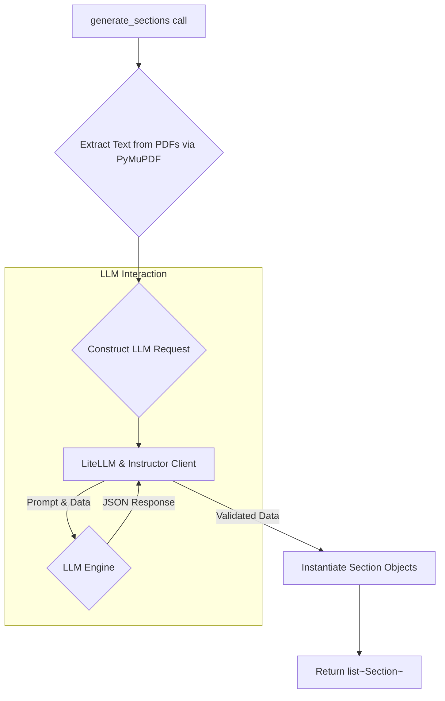

# Section Generation Protocol

The `section_producer.py` module is the cornerstone of the application's content analysis capabilities. It orchestrates the transformation of raw presentation and transcript files into the structured `Section` data required for live navigation.

## Process Flow

The generation process is a multi-stage pipeline:

1.  **PDF Text Extraction**: The `generate_sections` function begins by invoking a private `_extract_pdf` utility. This utility uses the `PyMuPDF` library to extract text content from the source presentation and transcript PDFs. The presentation is converted into a Markdown-like format where each page is a distinct section, while the transcript is concatenated into a single, continuous block of text.

2.  **LLM Invocation**: The extracted presentation text and the full transcript are then passed to the `_call_llm` function. This function acts as a client to a Large Language Model (LLM).

3.  **Structured Response Modeling**: A key aspect of the LLM interaction is the use of the `instructor` library. This library patches the `LiteLLM` completion function to enforce a specific Pydantic response model (`SectionsOutputModel`). This guarantees that the LLM's JSON output is not only syntactically correct but also semantically compliant with the required data structure (a list of sections with specific fields and types).

4.  **System Prompt Engineering**: The LLM's behavior is strictly governed by a detailed system prompt located in `src/data/llm_instruction.md`. This prompt defines the rules for the task, instructing the LLM to generate one text segment for each slide, using the transcript as the authoritative source for content and language. It explicitly commands the model to match the topic of each slide to the relevant part of the transcript and to synthesize content only as a last resort.

5.  **Object Instantiation**: The validated content list returned by the LLM is used to instantiate a list of `Section` objects, each assigned its corresponding `section_index`.

## LLM Instruction Constraints

The `llm_instruction.md` file imposes several critical constraints on the LLM:

-   The number of generated sections must *exactly* match the number of slides.
-   The transcript is the immutable source of truth for all content and language.
-   Non-substantive text from the slides (titles, page numbers, formatting artifacts) must be ignored.
-   If a slide's topic is absent from the transcript, the LLM must synthesize a concise, style-matching sentence rather than leaving the section blank.

