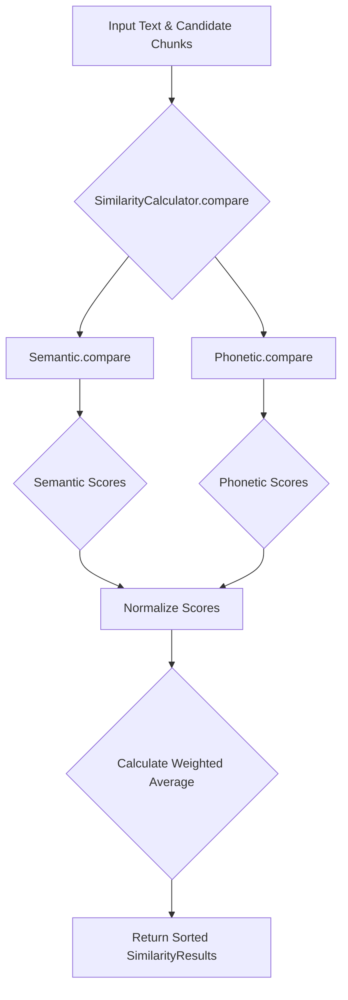

# Similarity Calculations

The `SimilarityCalculator` class (`src/core/components/similarity_calculator.py`) is the core component responsible for determining how closely the speaker's live speech matches the content of the presentation. It uses a hybrid approach, combining both semantic and phonetic similarity for a more robust and accurate comparison.

## Hybrid Approach

The calculator combines two different types of similarity measures:

- **Semantic Similarity**: Focuses on the *meaning* of the words. It can identify that "sunny weather" is similar to "a bright day," even if the words themselves are different.
- **Phonetic Similarity**: Focuses on the *sound* of the words. It can identify that "write" and "right" are similar, even if their meanings are completely different.

By combining these two approaches with adjustable weights, the system can handle both variations in wording and potential speech-to-text errors.

## Workflow

1.  The `compare` method receives the speaker's most recent transcribed words and a list of candidate chunks.
2.  It calls the `Semantic` and `Phonetic` similarity units independently to get scores for each candidate chunk.
3.  The raw scores from both units are normalized to a common scale (0 to 1).
4.  The normalized scores are then combined using a weighted average (e.g., 60% semantic, 40% phonetic).
5.  The final weighted scores are used to rank the candidate chunks, and the chunk with the highest score is considered the best match.

### Semantic Similarity

The `Semantic` class (`src/core/components/similarity_units/semantic.py`) uses the `fastembed` library with a pre-trained `all-MiniLM-l6-v2` sentence transformer model. It converts the input text and each candidate chunk into numerical vectors (embeddings) and then calculates the cosine similarity between them.

### Phonetic Similarity

The `Phonetic` class (`src/core/components/similarity_units/phonetic.py`) uses the `jellyfish` library to convert text into its Metaphone phonetic representation. It then uses the `rapidfuzz` library to calculate the similarity ratio between the phonetic codes of the input text and the candidate chunks.
