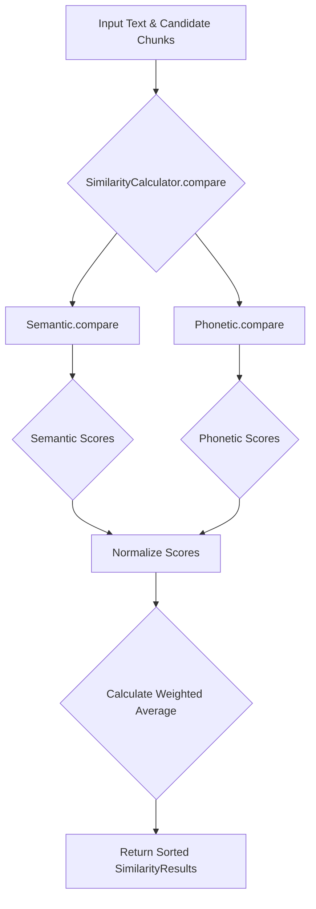

# Hybrid Similarity Calculation

The `SimilarityCalculator` class is the analytical core of the live presentation controller. It determines the degree of correspondence between the speaker's live speech and the pre-processed presentation content. It employs a hybrid, weighted algorithm that combines semantic and phonetic similarity measures for robust and nuanced matching.

## Hybrid Similarity Model

The calculator fuses two distinct similarity dimensions:

-   **Semantic Similarity**: Focuses on the conceptual meaning of the text. It can identify that "solar power" is related to "energy from the sun," even if the lexical items differ. This is crucial for handling paraphrasing and variations in speech.
-   **Phonetic Similarity**: Focuses on the acoustic representation of words. It can identify that "write" and "right" are similar, which is vital for correcting potential errors from the speech-to-text engine.

The final similarity score is a weighted average of the normalized scores from these two channels.

## Calculation Workflow

1.  **Invocation**: The `compare` method is called with the speaker's most recent transcribed words (as a single string) and a list of `candidate chunks`.
2.  **Parallel Comparison**: It independently calls the `Semantic.compare` and `Phonetic.compare` methods to get two separate lists of `SimilarityResult` objects.
3.  **Score Normalization**: The raw scores from each unit are normalized to a common scale (0.0 to 1.0) using a private `_normalize_scores` method. This method performs min-max scaling on scores that meet a minimum threshold (0.5), effectively amplifying the significance of reasonably good matches while discarding poor ones.
4.  **Weighted Averaging**: The final score for each chunk is calculated using a weighted average formula:
    *Scorefinal = (wsem * Scoresem_norm) + (wpho * Scorepho_norm)*
    Where `w_sem` and `w_pho` are the weights for semantic and phonetic similarity (e.g., 0.6 and 0.4).
5.  **Ranking**: The final list of `SimilarityResult` objects is sorted in descending order by the final weighted score, and the chunk with the highest score is identified as the best match.

### Semantic Similarity Unit

The `Semantic` class uses the `fastembed` library with a pre-trained and quantized `sentence-transformers/all-MiniLM-l6-v2` model. It converts the input text and candidate chunks into high-dimensional vectors (embeddings). The similarity is then calculated as the **cosine similarity** between the input vector and each candidate vector, which measures the cosine of the angle between them in the vector space.

### Phonetic Similarity Unit

The `Phonetic` class uses the `jellyfish` library to convert text into its **Metaphone** phonetic encoding (e.g., "phonetics" -> `FNTKS`). It then uses the `rapidfuzz` library to calculate the **Fuzz Ratio**, a measure of string similarity, between the Metaphone code of the input text and that of each candidate chunk.