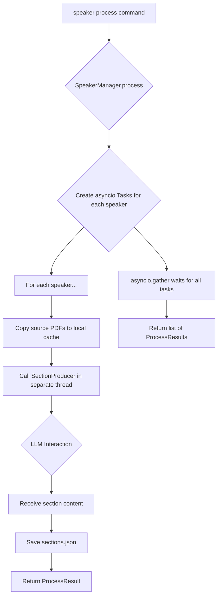

# Speaker Data Management

The `SpeakerManager` class is the primary interface for all operations related to speaker profiles and their associated data. It handles the lifecycle of a speaker, from creation to processing and deletion.

## Key Responsibilities

-   **Adding Speakers**: Creates a new speaker profile. It generates a unique, URL-safe `speaker_id` using the `id_generator` utility and saves the speaker's metadata (name, ID, source file paths) to a `speaker.json` file within a dedicated subdirectory.
-   **Editing Speakers**: Updates an existing speaker's profile with new source file paths.
-   **Resolving Speakers**: Provides a robust mechanism to find and retrieve a `Speaker` object based on either their unique `speaker_id` or their `name`. It handles ambiguity by raising an error if a name matches multiple speakers.
-   **Processing Speakers**: This is the most complex operation, orchestrating the asynchronous generation of presentation sections. It uses `asyncio` to process multiple speakers concurrently, improving efficiency.
-   **Deleting Speakers**: Removes a speaker's entire data directory, including their profile, cached files, and generated sections.
-   **Listing Speakers**: Retrieves a list of all registered speakers by scanning the data directory.

## Asynchronous Speaker Processing Workflow

The `process` method is designed to be non-blocking and efficient, especially when handling multiple speakers.

1.  **Initialization**: An `asyncio` event loop is started.
2.  **Task Creation**: For each speaker, an `asyncio.Task` is created to run the `process_speaker` coroutine. A small, incremental delay is added to each task to stagger the initiation of LLM API calls, preventing potential rate-limiting issues.
3.  **File Caching**: Within each task, the manager copies the speaker's source presentation and transcript files to their local data directory. This ensures that the application has a local, stable copy of the files to work with.
4.  **Section Generation**: The task then calls the `section_producer.generate_sections` function (wrapped in `asyncio.to_thread` to run the synchronous function in a separate thread without blocking the event loop). This performs the PDF extraction and LLM interaction.
5.  **Data Persistence**: The generated `Section` objects are saved to a `sections.json` file.
6.  **Aggregation**: `asyncio.gather` waits for all speaker processing tasks to complete, collecting a `ProcessResult` object from each.

