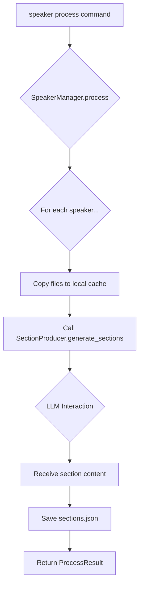

# Speaker Management

The `SpeakerManager` class, located in `src/core/speaker_manager.py`, is responsible for all operations related to speaker profiles and their associated data.

## Key Responsibilities

- **Adding Speakers**: Creates a new speaker profile with a unique ID, and stores the provided presentation and transcript file paths.
- **Editing Speakers**: Updates an existing speaker's profile with new file paths.
- **Resolving Speakers**: Finds a speaker by their name or unique ID.
- **Processing Speakers**: The most complex operation, this orchestrates the process of generating presentation sections using an LLM. It involves:
    - Copying the speaker's presentation and transcript files to a local data directory.
    - Calling the `SectionProducer` to extract text and interact with the LLM.
    - Saving the generated sections to a `sections.json` file.
- **Deleting Speakers**: Removes a speaker's profile and all associated data from the system.
- **Listing Speakers**: Retrieves a list of all registered speakers.

## Workflow: Processing a Speaker

