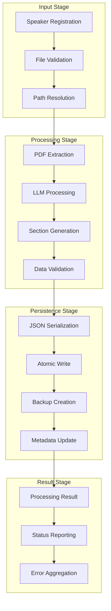

# Speaker Management - Content Processing Pipeline

## Overview

The Speaker Management subsystem orchestrates the complete lifecycle of presentation content from raw PDF documents to structured, searchable sections optimized for real-time voice navigation. This sophisticated pipeline combines multi-threaded processing, AI-powered content segmentation, and robust error handling to transform static presentation materials into dynamic, voice-controllable assets.

## Architecture Components

### SpeakerManager Class

**Core Responsibilities**:
- **CRUD Operations**: Complete speaker lifecycle management with data validation
- **Asynchronous Processing**: Concurrent speaker processing with configurable parallelism  
- **File Management**: Source file tracking with local caching and fallback mechanisms
- **Data Persistence**: Atomic operations with rollback capability and consistency guarantees

```python
class SpeakerManager:
    def __init__(self):
        self.SPEAKERS_PATH = data_handler.DATA_FOLDER.resolve() / "speakers"

    def add(self, name: str, source_presentation: Path, source_transcript: Path) -> Speaker
    def edit(self, speaker: Speaker, source_presentation: Path | None = None, source_transcript: Path | None = None) -> Speaker  
    def process(self, speakers: list[Speaker], llm_model: str, llm_api_key: str) -> list[ProcessResult]
    def delete(self, speaker: Speaker) -> bool
    def list(self) -> list[Speaker]
    def resolve(self, speaker_pattern: str) -> Speaker
```

### Processing Pipeline Architecture

**Multi-Stage Processing**:
1. **Input Validation**: File existence, format verification, and accessibility checks
2. **Content Extraction**: PDF text extraction with OCR fallback and noise filtering
3. **LLM Segmentation**: Structured content generation with validation and retry logic
4. **Data Persistence**: Atomic file operations with backup and recovery mechanisms
5. **Result Aggregation**: Processing metadata compilation with status tracking



## Speaker Operations

### Add Operation

**Functionality**: Creates new speaker profiles with comprehensive validation and metadata generation.

**Implementation Details**:
```python
def add(self, name: str, source_presentation: Path, source_transcript: Path) -> Speaker:
    current_speakers = self.list()
    speaker_ids = [speaker.speaker_id for speaker in current_speakers]
    
    if name in speaker_ids:
        raise ValueError(f"Given name '{name}' can't be same with existing speaker IDs.")
    
    speaker_id = id_generator.generate_speaker_id(name)
    speaker_path = self.SPEAKERS_PATH / speaker_id
    
    speaker = Speaker(
        name=name,
        speaker_id=speaker_id,
        source_presentation=source_presentation.resolve(),
        source_transcript=source_transcript.resolve(),
    )
    
    data = {k: str(v) if isinstance(v, Path) else v for k, v in asdict(speaker).items()}
    data_handler.write(speaker_path / "speaker.json", json.dumps(data, indent=4))
    return speaker
```

**Validation Rules**:
- **Unique Name Constraint**: Prevents speaker name collisions with existing profiles
- **File Existence Verification**: Ensures source files are accessible before registration
- **Path Resolution**: Converts relative paths to absolute paths for consistency
- **ID Generation**: Deterministic speaker ID creation with collision detection

### Edit Operation

**Functionality**: Updates speaker metadata and source file references with validation and consistency preservation.

**Advanced Features**:
- **Selective Updates**: Allows updating individual attributes without affecting others
- **Path Validation**: Ensures new file paths exist and are accessible
- **Metadata Consistency**: Preserves existing processing results when possible
- **Atomic Operations**: Prevents partial updates through transactional writes

### Process Operation

**Functionality**: Executes the complete content processing pipeline with asynchronous execution and comprehensive error handling.

**Asynchronous Architecture**:
```python
async def run():
    speaker_paths = [self.SPEAKERS_PATH / speaker.speaker_id for speaker in speakers]
    
    async def process_speaker(speaker, speaker_path, delay):
        await asyncio.sleep(delay)  # Stagger processing to prevent API rate limits
        
        # File source determination with fallback logic
        source_presentation = speaker.source_presentation
        source_transcript = speaker.source_transcript
        local_presentation = speaker_path / "presentation.pdf"
        local_transcript = speaker_path / "transcript.pdf"
        
        # Processing implementation...
        sections = await asyncio.to_thread(
            section_producer.generate_sections,
            presentation_path=presentation_path,
            transcript_path=transcript_path,
            llm_model=llm_model,
            llm_api_key=llm_api_key,
        )
        
        return ProcessResult(...)
    
    tasks = [process_speaker(speaker, speaker_path, idx) for idx, (speaker, speaker_path) in enumerate(zip(speakers, speaker_paths))]
    results = await asyncio.gather(*tasks)
    return results
```

**Concurrency Features**:
- **Parallel Processing**: Multiple speakers processed simultaneously with controlled concurrency
- **Rate Limit Management**: Staggered processing to respect API quotas and prevent throttling
- **Error Isolation**: Individual speaker failures don't affect other processing operations
- **Resource Optimization**: Thread pool utilization for CPU-intensive operations

## Content Processing Pipeline

### PDF Text Extraction

**Implementation**: PyMuPDF-based extraction with specialized handling for different document types.

```python
def _extract_pdf(pdf_path: Path, extraction_type: Literal["transcript", "presentation"]) -> str:
    with pymupdf.open(pdf_path) as doc:
        match extraction_type:
            case "transcript":
                full_text = "".join(page.get_text("text") for page in doc)
                result = " ".join(full_text.split())
                return result
            case "presentation":
                markdown_sections = []
                for i, page in enumerate(doc):
                    page_text = page.get_text("text")
                    cleaned_text = " ".join(page_text.split())
                    markdown_sections.append(f"# Slide Page {i}\n{cleaned_text}")
                return "\n\n".join(markdown_sections)
```

**Extraction Strategies**:
- **Transcript Mode**: Continuous text extraction with whitespace normalization
- **Presentation Mode**: Slide-segmented extraction with markdown structure preservation
- **Content Cleaning**: Removal of formatting artifacts and OCR noise
- **Error Recovery**: Robust exception handling with detailed error context

### LLM Integration Pipeline

**Architecture**: Instructor-enhanced structured output generation with comprehensive validation and retry logic.

**Processing Components**:
- **Structured Prompts**: Domain-specific instruction templates for optimal LLM performance
- **Response Validation**: Pydantic model validation with constraint enforcement
- **Temperature Control**: Low temperature (0.2) for consistent, deterministic output
- **Error Handling**: Comprehensive retry logic with exponential backoff

**Implementation Details**:
```python
def _call_llm(presentation_data: str, transcript_data: str, llm_model: str, llm_api_key: str) -> list[str]:
    system_prompt = Path("src/data/llm_instruction.md").read_text(encoding="utf-8")
    client = instructor.from_litellm(completion, mode=instructor.Mode.JSON)
    
    response = client.chat.completions.create(
        model=llm_model,
        api_key=llm_api_key,
        messages=[
            {"role": "system", "content": system_prompt},
            {"role": "user", "content": f"Presentation: {presentation_data}\nTranscript: {transcript_data}"},
        ],
        response_model=SectionsOutputModel,
        temperature=0.2,
    )
    
    return [item.content for item in response.sections]
```

### Data Persistence Strategy

**Storage Architecture**:
- **Hierarchical Organization**: Speaker-specific directories with structured metadata
- **JSON Serialization**: Cross-platform compatible data formats with schema validation
- **Atomic Operations**: Temporary file patterns with atomic moves to prevent corruption
- **Backup Mechanisms**: Processing result preservation with rollback capability

**File Organization**:
```
~/.moves/speakers/{speaker_id}/
├── speaker.json          # Speaker metadata and configuration
├── sections.json         # Generated section objects with indices
├── presentation.pdf      # Local cache (optional)
└── transcript.pdf        # Local cache (optional)
```

## Error Handling and Recovery

### Validation Framework

**File Validation**:
- **Existence Checks**: Comprehensive file system validation before processing
- **Format Verification**: PDF format validation with corruption detection
- **Accessibility Testing**: Read permission and file lock detection
- **Size Constraints**: Reasonable file size limits to prevent resource exhaustion

**Processing Validation**:
- **Section Count Verification**: Generated sections must match presentation slide count
- **Content Quality Checks**: Empty section detection with retry mechanisms
- **Index Consistency**: Sequential index validation with gap detection
- **Data Integrity**: JSON schema validation with type checking

### Recovery Mechanisms

**Processing Failures**:
- **Partial Success Handling**: Preserve successful processing results during partial failures
- **Retry Logic**: Configurable retry attempts with exponential backoff and jitter
- **Fallback Strategies**: Alternative processing paths for common failure scenarios
- **State Restoration**: Ability to resume processing from last successful checkpoint

**Data Corruption Recovery**:
- **Backup Restoration**: Automatic recovery from backup files during corruption detection
- **Consistency Repair**: Data structure repair mechanisms for recoverable corruption
- **Manual Recovery**: CLI tools for advanced recovery operations
- **Data Export**: Export capabilities for external backup and recovery tools

## Performance Optimization

### Concurrency Management

**Async Processing Benefits**:
- **I/O Optimization**: Non-blocking file operations and network requests
- **CPU Utilization**: Optimal thread pool usage for compute-intensive operations  
- **Memory Efficiency**: Streaming processing for large documents
- **Responsiveness**: Non-blocking CLI operations during long-running processes

**Resource Management**:
- **Connection Pooling**: Reused HTTP connections for LLM API requests
- **Memory Limits**: Configurable memory constraints for large document processing
- **Disk Space Monitoring**: Automatic cleanup of temporary files and caches
- **Rate Limiting**: Intelligent request pacing to prevent API quotas exhaustion

### Caching Strategies

**Processing Cache**:
- **Section Cache**: Persistent section storage to avoid reprocessing unchanged files
- **Extraction Cache**: Cached PDF extraction results with file modification tracking
- **LLM Response Cache**: Response caching for identical input combinations
- **Metadata Cache**: In-memory caching of frequently accessed speaker metadata

**Cache Invalidation**:
- **File Modification Detection**: Automatic cache invalidation based on source file changes
- **Version-Based Invalidation**: Cache versioning for system upgrades and changes
- **Manual Cache Control**: CLI commands for cache management and debugging
- **Storage Limits**: Automatic cache cleanup based on size and age constraints