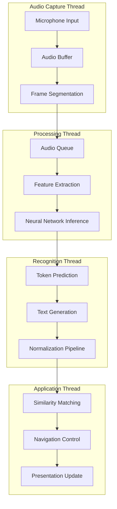

# Streaming STT - Real-Time Speech Recognition Architecture

## Overview

The Streaming Speech-to-Text (STT) subsystem implements a high-performance, real-time audio processing pipeline using Sherpa-ONNX neural network models. This sophisticated architecture combines continuous audio capture, neural network inference, and text normalization to enable seamless voice-controlled presentation navigation with minimal latency and high accuracy.

## Architecture Components

### Neural Network Infrastructure

**Sherpa-ONNX Transducer Architecture**: State-of-the-art RNN-Transducer model with optimized ONNX runtime for edge deployment.

```python
self.recognizer = OnlineRecognizer.from_transducer(
    tokens=str(Path("src/core/components/ml_models/stt/tokens.txt")),
    encoder=str(Path("src/core/components/ml_models/stt/encoder.int8.onnx")),
    decoder=str(Path("src/core/components/ml_models/stt/decoder.int8.onnx")),
    joiner=str(Path("src/core/components/ml_models/stt/joiner.int8.onnx")),
    num_threads=8,
    decoding_method="greedy_search",
)
```

**Model Components**:
- **Encoder**: Acoustic feature extraction with convolutional and recurrent layers
- **Decoder**: Language model integration with prediction network
- **Joiner**: Output probability distribution combination and token prediction
- **Token Vocabulary**: Subword tokenization with byte-pair encoding optimization

### Audio Processing Pipeline

**Multi-Threaded Architecture**: Segregated audio capture, processing, and recognition threads for optimal performance.



**Performance Characteristics**:
- **Sample Rate**: 16kHz optimized for speech recognition accuracy
- **Frame Duration**: 100ms frames for optimal latency-accuracy balance
- **Buffer Management**: Circular buffer with 5-frame capacity for smooth processing
- **Thread Coordination**: Lock-free queues for inter-thread communication

## Real-Time Audio Processing

### Audio Capture Configuration

**SoundDevice Integration**: Cross-platform audio capture with configurable parameters and error handling.

```python
def _audio_callback(self, indata, frames, time, status):
    try:
        if status:
            logger.warning(f"Audio callback status: {status}")
        
        audio_data = indata[:, 0]  # Mono channel extraction
        self.audio_queue.append(audio_data.copy())
        
    except Exception as e:
        logger.error(f"Audio callback error: {e}")
```

**Capture Features**:
- **Automatic Device Selection**: Intelligent default audio device selection with fallback
- **Error Recovery**: Robust error handling with automatic reconnection capability
- **Latency Optimization**: Low-latency audio drivers with ASIO support where available
- **Dynamic Configuration**: Runtime audio parameter adjustment without restart

### Stream-Based Processing

**Continuous Recognition Pipeline**: Frame-by-frame processing with state preservation across audio segments.

```python
def _process_recognition(self):
    while not self.shutdown_flag.is_set():
        try:
            if self.audio_queue:
                audio_frame = self.audio_queue.popleft()
                
                # Convert to required format for ONNX model
                samples = (audio_frame * 32768).astype(np.int16)
                self.stream.accept_waveform(self.sample_rate, samples)
                
                # Check for recognition results
                if self.recognizer.is_ready(self.stream):
                    text = self.recognizer.get_result(self.stream).text
                    if text.strip():
                        self._handle_recognition_result(text)
                        
        except Exception as e:
            logger.error(f"Recognition processing error: {e}")
```

**Processing Optimization**:
- **Non-blocking Operations**: Asynchronous processing to prevent audio dropouts
- **Memory Management**: Efficient buffer reuse and garbage collection optimization
- **State Management**: Recognition state preservation across audio segments
- **Quality Control**: Audio quality monitoring with automatic adjustment

## Neural Network Optimization

### ONNX Runtime Configuration

**Quantization and Optimization**: INT8 quantization with graph optimization for edge deployment.

**Model Characteristics**:
- **Quantization**: INT8 weights with dynamic quantization for activations
- **Graph Optimization**: Operator fusion and constant folding for inference acceleration
- **Memory Footprint**: Optimized model size for resource-constrained deployment
- **Threading**: Multi-threaded inference with configurable thread pool size

### Inference Pipeline

**Streaming Inference**: Frame-by-frame neural network processing with state management.

```python
# Acoustic feature processing
self.stream.accept_waveform(self.sample_rate, samples)

# Neural network inference
if self.recognizer.is_ready(self.stream):
    result = self.recognizer.get_result(self.stream)
    text = result.text
    
    # Confidence scoring and validation
    if result.confidence > threshold:
        self._process_recognized_text(text)
```

**Inference Optimization**:
- **Batch Processing**: Frame batching for improved throughput when possible
- **Memory Pooling**: Pre-allocated tensors for consistent memory usage
- **CPU Optimization**: SIMD instruction utilization for mathematical operations
- **Threading**: Parallel processing for encoder and decoder components

## Text Normalization Pipeline

### Multi-Stage Normalization

**Comprehensive Text Processing**: Unicode normalization, punctuation handling, and domain-specific cleaning.

```python
def normalize_text(text: str) -> str:
    # Unicode normalization
    text = unicodedata.normalize("NFC", text.lower())
    
    # Emoji and special character removal
    text = re.sub(r'[\U0001f600-\U0001f64f\U0001f300-\U0001f5ff...]+', '', text, flags=re.UNICODE)
    
    # Quote normalization
    text = text.translate(str.maketrans({
        "'": "'", "'": "'", "‚": "'", "‛": "'",
        """: '"', """: '"', "„": '"', "‟": '"',
    }))
    
    # Number-to-word conversion
    text = re.sub(r'\d+', lambda m: num2words(m.group(0)).replace("-", " "), text)
    
    # Punctuation and whitespace cleanup
    text = re.sub(r'[^\w\s\'"`]', ' ', text, flags=re.UNICODE)
    return re.sub(r'\s+', ' ', text).strip()
```

**Normalization Features**:
- **Unicode Compliance**: NFC normalization for consistent character representation
- **Punctuation Handling**: Smart punctuation normalization with context awareness
- **Number Processing**: Numerical to textual conversion for improved matching
- **Language Support**: Multi-language character handling with locale awareness

### Domain-Specific Processing

**Presentation Context Optimization**: Specialized processing for presentation and academic content.

**Processing Enhancements**:
- **Technical Term Handling**: Preservation of domain-specific terminology
- **Abbreviation Expansion**: Common abbreviation expansion for improved matching
- **Capitalization Normalization**: Case-insensitive processing with proper noun preservation
- **Filler Word Removal**: Optional removal of speech fillers and hesitations

## Performance Optimization

### Latency Minimization

**End-to-End Latency**: Sub-200ms total latency from speech to navigation action.

**Latency Breakdown**:
- **Audio Capture**: 100ms (frame duration)
- **Feature Extraction**: 10-20ms (vectorized operations)
- **Neural Network Inference**: 30-50ms (quantized models)
- **Text Processing**: 5-10ms (optimized normalization)
- **Similarity Matching**: 20-30ms (cached operations)

### Memory Management

**Resource Optimization**: Efficient memory usage with predictable allocation patterns.

```python
class AudioProcessor:
    def __init__(self):
        # Pre-allocated buffers for consistent memory usage
        self.audio_buffer = np.zeros(self.frame_size, dtype=np.float32)
        self.feature_buffer = np.zeros(self.feature_size, dtype=np.float32)
        self.audio_queue = deque(maxlen=5)  # Fixed-size queue
```

**Memory Features**:
- **Buffer Pre-allocation**: Fixed-size buffers to prevent allocation overhead
- **Circular Buffers**: Efficient queue management with automatic overflow handling
- **Garbage Collection**: Optimized object lifecycle management for real-time performance
- **Memory Pooling**: Reusable memory pools for temporary processing buffers

### Threading Architecture

**Lock-Free Design**: High-performance inter-thread communication with minimal synchronization overhead.

**Thread Coordination**:
- **Producer-Consumer Pattern**: Audio capture feeds processing pipeline
- **Event-Driven Processing**: Recognition results trigger navigation logic
- **Graceful Shutdown**: Coordinated thread shutdown with resource cleanup
- **Error Isolation**: Thread-level error handling to prevent cascade failures

## Integration with Presentation Control

### Recognition Result Processing

**Text-to-Navigation Pipeline**: Seamless integration with similarity matching and navigation control.

```python
def _handle_recognition_result(self, text: str):
    try:
        normalized_text = text_normalizer.normalize_text(text)
        
        # Update word history for context
        words = normalized_text.split()
        self.recent_words.extend(words)
        
        # Generate navigation command
        if len(self.recent_words) >= self.window_size:
            window_text = " ".join(self.recent_words)
            candidate_chunks = chunk_producer.get_candidate_chunks(
                self.current_section, self.chunks
            )
            
            # Similarity-based navigation
            results = self.similarity_calculator.compare(window_text, candidate_chunks)
            if results and results[0].score > threshold:
                self._execute_navigation(results[0])
                
    except Exception as e:
        logger.error(f"Recognition result processing error: {e}")
```

### Navigation Command Generation

**Context-Aware Navigation**: Intelligent navigation decisions based on recognition confidence and similarity scores.

**Decision Logic**:
- **Confidence Thresholding**: Minimum recognition confidence for navigation actions
- **Similarity Scoring**: Weighted similarity scores for navigation decisions
- **Context Window**: Sliding window of recent words for improved context matching
- **False Positive Prevention**: Multiple validation layers to prevent incorrect navigation

## Error Handling and Robustness

### Fault Tolerance

**Comprehensive Error Recovery**: Multi-layer error handling with graceful degradation and automatic recovery.

**Recovery Mechanisms**:
- **Audio Device Failures**: Automatic device reconnection with fallback options
- **Model Loading Errors**: Graceful fallback to alternative model configurations
- **Memory Exhaustion**: Automatic buffer management with overflow protection
- **Thread Synchronization**: Deadlock prevention with timeout mechanisms

### Quality Assurance

**Recognition Quality Monitoring**: Continuous quality assessment with adaptive optimization.

**Quality Metrics**:
- **Recognition Accuracy**: Real-time accuracy monitoring with confidence scoring
- **Latency Tracking**: End-to-end latency measurement with performance alerts
- **Resource Utilization**: CPU and memory usage monitoring with threshold alerts
- **Error Rate Analysis**: Recognition error patterns for model optimization

## Configuration and Customization

### Runtime Configuration

**Adaptive Parameter Tuning**: Dynamic configuration adjustment based on performance metrics and user preferences.

```python
class STTConfiguration:
    sample_rate: int = 16000
    frame_duration: float = 0.1
    recognition_threshold: float = 0.7
    max_threads: int = 8
    buffer_size: int = 5
    
    def update_from_performance_metrics(self, metrics: dict):
        if metrics['latency'] > self.target_latency:
            self.reduce_quality_for_speed()
        elif metrics['accuracy'] < self.target_accuracy:
            self.increase_quality_settings()
```

### Model Management

**Dynamic Model Loading**: Support for multiple model variants with runtime switching capability.

**Model Features**:
- **Multi-Language Support**: Language-specific models with automatic detection
- **Domain Adaptation**: Specialized models for technical presentations
- **Size Variants**: Trade-off between model size and accuracy for different deployment scenarios
- **Update Mechanism**: Over-the-air model updates with validation and rollback capability