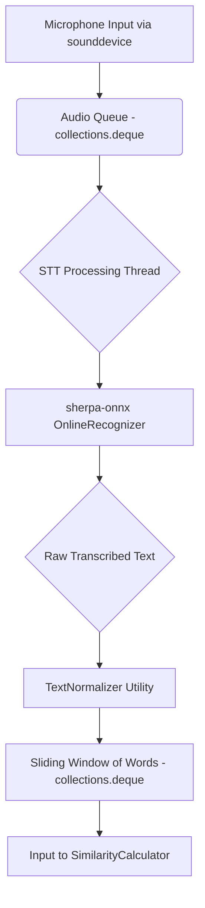

# Real-time Speech-to-Text Pipeline

The real-time transcription functionality is managed by the `PresentationController` and relies on a low-latency streaming speech-to-text (STT) pipeline built around the `sherpa-onnx` library.

## STT Architecture and Flow

1.  **Audio Input**: The system uses the `sounddevice` library to capture audio from the user's default microphone. Audio is captured in small, continuous frames with a duration of 100ms at a sample rate of 16,000 Hz.

2.  **Asynchronous Audio Queue**: The captured audio frames (as NumPy arrays) are pushed into a `collections.deque` with a fixed maximum length. This `deque` serves as a thread-safe buffer between the audio input callback and the STT processing thread.

3.  **STT Processing Thread**: A dedicated background thread continuously pulls audio chunks from the queue. Each chunk is fed into the `sherpa-onnx` `OnlineRecognizer` instance via its `accept_waveform` method.

4.  **Real-time Decoding**: The `OnlineRecognizer` processes the audio stream incrementally. After each chunk is accepted, the system checks `is_ready` and calls `decode_stream` to update the recognition result. This provides a continuous stream of partial and final transcription results.

5.  **Text Normalization**: The raw transcribed text from the recognizer is immediately passed to the `TextNormalizer` utility. This function standardizes the text by converting it to lowercase, expanding numbers to words (e.g., 123 to "one hundred twenty-three"), and removing punctuation and other non-essential characters.

6.  **Sliding Window of Words**: The normalized words are stored in another `deque` that acts as a sliding window, always holding the most recent N words (where N is the `window_size`, typically 12). This window of recent words becomes the input for the `SimilarityCalculator`.

## STT Model

The application utilizes a pre-trained, quantized Nemo streaming STT model, optimized for fast performance. The model files, including the ONNX encoder, decoder, and joiner, are located in `src/core/components/ml_models/nemo-streaming-stt-480ms-int8/`. The model's vocabulary is defined in the `tokens.txt` file.

