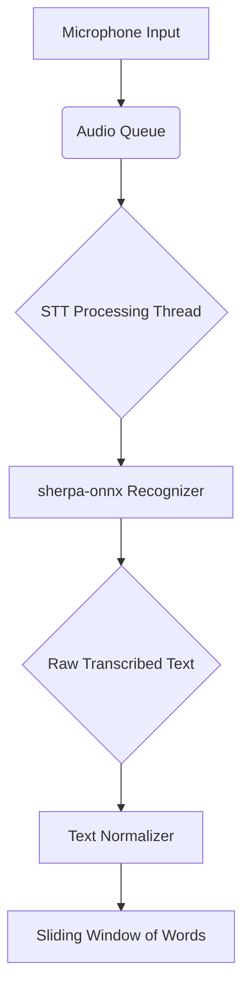

# Streaming Speech-to-Text

The real-time transcription functionality is a critical part of the `PresentationController` in `src/core/presentation_controller.py`. It uses the `sherpa-onnx` library to perform streaming speech-to-text (STT) with a pre-trained model.

## How It Works

1.  **Audio Input**: The application captures audio from the user's default microphone in small chunks.
2.  **Audio Queue**: These audio chunks are placed into a queue for processing.
3.  **STT Model**: A dedicated thread continuously takes audio chunks from the queue and feeds them into the `sherpa-onnx` `OnlineRecognizer`.
4.  **Real-time Transcription**: The recognizer processes the audio and outputs the transcribed text as it becomes available.
5.  **Text Normalization**: The raw transcribed text is passed through a `TextNormalizer` to convert it to a clean, consistent format (lowercase, numbers to words, etc.).
6.  **Recent Words**: The normalized words are stored in a sliding window (`deque`) that always contains the most recent words spoken by the user. This window of words is then used for similarity comparison.

## The Model

The application uses a pre-trained, quantized Nemo streaming STT model. The model files are located in `src/core/components/ml_models/nemo-streaming-stt-480ms-int8/`.

