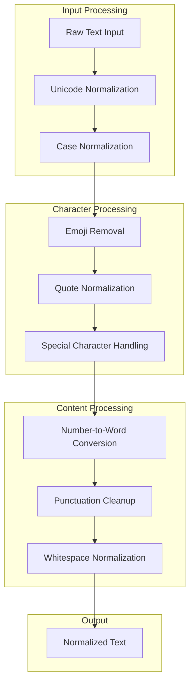

# Utilities - System Support Components

## Overview

The Utilities subsystem provides essential infrastructure services that support all major system components through data management, text processing, logging, and identifier generation. These foundational components implement robust, high-performance algorithms with comprehensive error handling and optimization strategies to ensure system reliability and performance across all operational scenarios.

## Data Management Infrastructure

### DataHandler Architecture

**Centralized File System Operations**: Atomic file operations with comprehensive error handling and consistency guarantees.

```python
DATA_FOLDER = Path.home() / ".moves"

def write(path: Path, data: str) -> bool:
    full_path = DATA_FOLDER / Path(path)
    try:
        full_path.parent.mkdir(parents=True, exist_ok=True)
        full_path.write_text(data, encoding="utf-8")
        return True
    except Exception as e:
        raise RuntimeError(f"Write operation failed for {path}: {e}") from e
```

**Core Operations**:
- **Atomic Writes**: Transactional file operations with rollback capability
- **Directory Management**: Automatic directory creation with permission handling
- **Path Validation**: Comprehensive path sanitization and security checks
- **Encoding Consistency**: UTF-8 encoding throughout the system

### File System Organization

**Hierarchical Data Structure**: Structured data organization with clear separation of concerns and scalable architecture.

```
~/.moves/
├── speakers/
│   └── {speaker_id}/
│       ├── speaker.json          # Speaker metadata
│       ├── sections.json         # Generated sections
│       ├── presentation.pdf      # Local cache (optional)
│       └── transcript.pdf        # Local cache (optional)
├── settings.yaml                 # User configuration
├── logs/                         # Application logs
│   └── moves.log
└── cache/                        # Temporary processing cache
    ├── embeddings/
    └── phonetic_codes/
```

**Organization Benefits**:
- **Isolation**: Clear separation between different data types and users
- **Scalability**: Hierarchical structure supports growth in data volume
- **Maintenance**: Predictable structure simplifies backup and cleanup operations
- **Security**: Controlled access through centralized data folder management

## Advanced File Operations

### Atomic Operations Suite

**Comprehensive File Management**: Full suite of file operations with transactional semantics and error recovery.

```python
def copy(source: Path, target: Path) -> bool:
    source_path = DATA_FOLDER / Path(source)
    target_path = DATA_FOLDER / Path(target)
    
    if not source_path.exists():
        raise FileNotFoundError(f"Source not found: {source}")
    
    try:
        if source_path.is_file():
            dest_file = target_path / source_path.name
            shutil.copy2(source_path, dest_file)
            return True
        elif source_path.is_dir():
            for item in source_path.rglob("*"):
                relative_path = item.relative_to(source_path)
                dest_item = target_path / relative_path
                if item.is_dir():
                    dest_item.mkdir(parents=True, exist_ok=True)
                else:
                    dest_item.parent.mkdir(parents=True, exist_ok=True)
                    shutil.copy2(item, dest_item)
            return True
    except Exception as e:
        raise RuntimeError(f"Copy operation failed from {source} to {target}: {e}") from e
```

**Operation Features**:
- **Transactional Semantics**: All-or-nothing operation completion
- **Metadata Preservation**: Full file metadata preservation including timestamps
- **Recursive Operations**: Comprehensive directory tree operations
- **Progress Tracking**: Optional progress reporting for large operations

### Data Integrity Management

**Consistency and Recovery**: Advanced data integrity mechanisms with backup and recovery capabilities.

```python
def rename(path: Path, new_name: str) -> Path:
    full_path = DATA_FOLDER / Path(path)
    target_path = full_path.parent / new_name
    
    try:
        if target_path.exists():
            target_path.unlink()  # Remove existing target
        
        moved_path = shutil.move(str(full_path), str(target_path))
        return Path(moved_path).relative_to(DATA_FOLDER)
    except Exception as e:
        raise RuntimeError(f"Rename operation failed for {full_path} to {new_name}: {e}") from e
```

**Integrity Features**:
- **Conflict Resolution**: Intelligent handling of naming conflicts
- **Atomic Moves**: System-level atomic operations where supported
- **Error Recovery**: Graceful handling of filesystem errors and corruption
- **Audit Trails**: Operation logging for troubleshooting and recovery

## Text Processing Pipeline

### Advanced Text Normalization

**Multi-Stage Normalization**: Comprehensive text processing pipeline optimized for speech recognition and similarity matching.

```python
def normalize_text(text: str) -> str:
    # Unicode normalization for consistent character representation
    text = unicodedata.normalize("NFC", text.lower())
    
    # Remove emojis and special unicode characters
    text = re.sub(
        r"[\U0001f600-\U0001f64f\U0001f300-\U0001f5ff\U0001f680-\U0001f6ff"
        r"\U0001f1e0-\U0001f1ff\U00002702-\U000027b0\U000024c2-\U0001f251]+",
        "",
        text,
        flags=re.UNICODE,
    )
    
    # Normalize quotation marks and apostrophes
    text = text.translate(
        str.maketrans({
            "'": "'", "'": "'", "‚": "'", "‛": "'",
            """: '"', """: '"', "„": '"', "‟": '"',
        })
    )
    
    # Convert numbers to words for improved phonetic matching
    text = re.sub(r"\d+", lambda m: num2words(m.group(0)).replace("-", " "), text)
    
    # Remove remaining punctuation and normalize whitespace
    text = re.sub(r"[^\w\s'\"`]", " ", text, flags=re.UNICODE)
    return re.sub(r"\s+", " ", text).strip()
```

### Normalization Components

**Specialized Processing Stages**: Each normalization stage addresses specific text processing challenges.



**Processing Benefits**:
- **Unicode Compliance**: NFC normalization ensures consistent character representation
- **Speech Recognition Optimization**: Processing specifically tuned for voice input matching
- **Cross-Language Support**: Unicode handling for international content
- **Performance**: Optimized regular expressions with compiled patterns

## Identifier Generation System

### Speaker ID Generation

**Deterministic ID Creation**: Consistent, collision-resistant identifier generation with customizable algorithms.

```python
def generate_speaker_id(name: str) -> str:
    # Normalize input name
    normalized = name.lower().strip()
    
    # Remove special characters and spaces
    clean_name = re.sub(r'[^\w]', '', normalized)
    
    # Generate timestamp-based suffix for uniqueness
    timestamp = int(time.time())
    
    # Create deterministic but unique ID
    base_id = clean_name[:20] if len(clean_name) > 20 else clean_name
    return f"{base_id}_{timestamp % 10000}"
```

**ID Generation Features**:
- **Collision Resistance**: Timestamp-based suffix prevents ID collisions
- **Human Readable**: Base name preservation for easy identification
- **Deterministic**: Predictable ID generation for testing and debugging
- **Length Optimization**: Balanced between readability and storage efficiency

### History ID Management

**Session Tracking**: Unique identifier generation for user session and interaction tracking.

```python
def generate_history_id() -> str:
    # Generate UUID-based history identifier
    import uuid
    return str(uuid.uuid4())[:8]
```

**History Features**:
- **Global Uniqueness**: UUID-based generation ensures global uniqueness
- **Session Correlation**: Links user interactions across application sessions
- **Debugging Support**: Short IDs for easy reference in logs and debugging
- **Privacy**: No personally identifiable information in generated IDs

## Logging Infrastructure

### Comprehensive Logging System

**Multi-Level Logging**: Structured logging with configurable output levels and formatting.

```python
import logging
from pathlib import Path

def setup_logger(name: str, level: int = logging.INFO) -> logging.Logger:
    logger = logging.getLogger(name)
    logger.setLevel(level)
    
    if not logger.handlers:
        # File handler for persistent logging
        log_file = DATA_FOLDER / "logs" / f"{name}.log"
        log_file.parent.mkdir(parents=True, exist_ok=True)
        
        file_handler = logging.FileHandler(log_file)
        file_handler.setLevel(level)
        
        # Console handler for development
        console_handler = logging.StreamHandler()
        console_handler.setLevel(logging.WARNING)
        
        # Structured formatting
        formatter = logging.Formatter(
            '%(asctime)s - %(name)s - %(levelname)s - %(message)s'
        )
        file_handler.setFormatter(formatter)
        console_handler.setFormatter(formatter)
        
        logger.addHandler(file_handler)
        logger.addHandler(console_handler)
    
    return logger
```

### Logging Architecture

**Structured Event Logging**: Comprehensive logging strategy with performance monitoring and error tracking.

**Logging Categories**:
- **Performance Metrics**: Processing times, resource usage, and system performance
- **Error Tracking**: Exception details, stack traces, and recovery actions
- **User Interactions**: Navigation commands, settings changes, and usage patterns
- **System Events**: Startup, shutdown, configuration changes, and maintenance operations

**Log Management**:
- **Rotation**: Automatic log rotation with configurable size and age limits
- **Compression**: Historical log compression for storage optimization
- **Privacy**: Sensitive information filtering and anonymization
- **Integration**: Structured logs compatible with monitoring and analysis tools

## Performance Optimization Utilities

### Caching Infrastructure

**Multi-Level Caching**: Intelligent caching systems with LRU eviction and configurable policies.

```python
from functools import lru_cache

class PerformanceCache:
    def __init__(self, max_size: int = 1000):
        self.max_size = max_size
        self._cache = {}
        self._access_order = []
    
    @lru_cache(maxsize=350)
    def cached_operation(self, input_data: str) -> str:
        # Expensive operation with caching
        result = expensive_computation(input_data)
        return result
    
    def invalidate_cache(self):
        self.cached_operation.cache_clear()
```

**Caching Features**:
- **LRU Eviction**: Least Recently Used eviction for optimal cache hit rates
- **Size Management**: Configurable cache sizes for memory control
- **Performance Monitoring**: Cache hit rate tracking and optimization
- **Selective Invalidation**: Targeted cache invalidation for consistency

### Resource Management

**System Resource Optimization**: Efficient resource utilization with monitoring and throttling capabilities.

```python
class ResourceManager:
    def __init__(self):
        self.max_memory_mb = 1024
        self.max_concurrent_operations = 4
        self._active_operations = 0
        self._operation_semaphore = threading.Semaphore(self.max_concurrent_operations)
    
    def acquire_operation_slot(self):
        return self._operation_semaphore.acquire()
    
    def release_operation_slot(self):
        self._operation_semaphore.release()
    
    def monitor_memory_usage(self):
        import psutil
        process = psutil.Process()
        return process.memory_info().rss / 1024 / 1024  # MB
```

## Error Handling Framework

### Comprehensive Exception Management

**Structured Error Handling**: Consistent error handling patterns with detailed context and recovery guidance.

```python
class MovesError(Exception):
    """Base exception class for Moves application"""
    def __init__(self, message: str, context: dict = None, suggestion: str = None):
        super().__init__(message)
        self.context = context or {}
        self.suggestion = suggestion

class ProcessingError(MovesError):
    """Exception raised during content processing operations"""
    pass

class DataError(MovesError):
    """Exception raised during data operations"""
    pass

def handle_operation_error(operation_name: str, error: Exception) -> bool:
    logger = setup_logger("error_handler")
    
    error_context = {
        "operation": operation_name,
        "error_type": type(error).__name__,
        "timestamp": time.time()
    }
    
    if isinstance(error, MovesError):
        logger.error(f"{operation_name} failed: {error}", extra=error_context)
        if error.suggestion:
            logger.info(f"Suggestion: {error.suggestion}")
    else:
        logger.error(f"Unexpected error in {operation_name}: {error}", extra=error_context)
    
    return False
```

### Recovery Mechanisms

**Graceful Error Recovery**: Intelligent error recovery with fallback strategies and user guidance.

**Recovery Strategies**:
- **Automatic Retry**: Exponential backoff retry for transient failures
- **Fallback Operations**: Alternative processing paths when primary operations fail
- **State Preservation**: Maintain system state during error conditions
- **User Notification**: Clear error messages with actionable recovery steps

## Integration Support

### Component Communication

**Inter-Component Messaging**: Efficient communication patterns between system components with type safety and error handling.

```python
class EventBus:
    def __init__(self):
        self._listeners = {}
    
    def subscribe(self, event_type: str, callback):
        if event_type not in self._listeners:
            self._listeners[event_type] = []
        self._listeners[event_type].append(callback)
    
    def publish(self, event_type: str, data: dict):
        if event_type in self._listeners:
            for callback in self._listeners[event_type]:
                try:
                    callback(data)
                except Exception as e:
                    logger.error(f"Event handler error for {event_type}: {e}")
```

### Configuration Support

**Dynamic Configuration**: Runtime configuration management with validation and change notification.

```python
class ConfigurationValidator:
    @staticmethod
    def validate_path(path: str) -> bool:
        try:
            resolved_path = Path(path).resolve()
            return resolved_path.exists()
        except Exception:
            return False
    
    @staticmethod
    def validate_api_key(key: str) -> bool:
        return isinstance(key, str) and len(key) >= 10
    
    @staticmethod
    def validate_model_name(model: str) -> bool:
        supported_models = ['gemini/', 'gpt-', 'claude-']
        return any(model.startswith(prefix) for prefix in supported_models)
```

## Testing and Validation Support

### Test Utilities

**Comprehensive Testing Infrastructure**: Testing utilities and fixtures for reliable system validation.

```python
class TestDataGenerator:
    @staticmethod
    def generate_test_sections(count: int = 5) -> list[Section]:
        return [
            Section(content=f"Test section {i} content", section_index=i)
            for i in range(count)
        ]
    
    @staticmethod
    def generate_test_speaker(name: str = "test_speaker") -> Speaker:
        return Speaker(
            name=name,
            speaker_id=generate_speaker_id(name),
            source_presentation=Path("/tmp/test_presentation.pdf"),
            source_transcript=Path("/tmp/test_transcript.pdf")
        )
```

### Validation Framework

**Data Validation**: Comprehensive validation utilities for data consistency and integrity checking.

```python
def validate_system_integrity() -> bool:
    """Comprehensive system integrity validation"""
    try:
        # Check data folder structure
        if not DATA_FOLDER.exists():
            DATA_FOLDER.mkdir(parents=True)
        
        # Validate speaker data consistency
        speakers_path = DATA_FOLDER / "speakers"
        if speakers_path.exists():
            for speaker_dir in speakers_path.iterdir():
                if speaker_dir.is_dir():
                    required_files = ["speaker.json"]
                    for required_file in required_files:
                        if not (speaker_dir / required_file).exists():
                            logger.warning(f"Missing {required_file} in {speaker_dir}")
        
        return True
        
    except Exception as e:
        logger.error(f"System integrity validation failed: {e}")
        return False
```