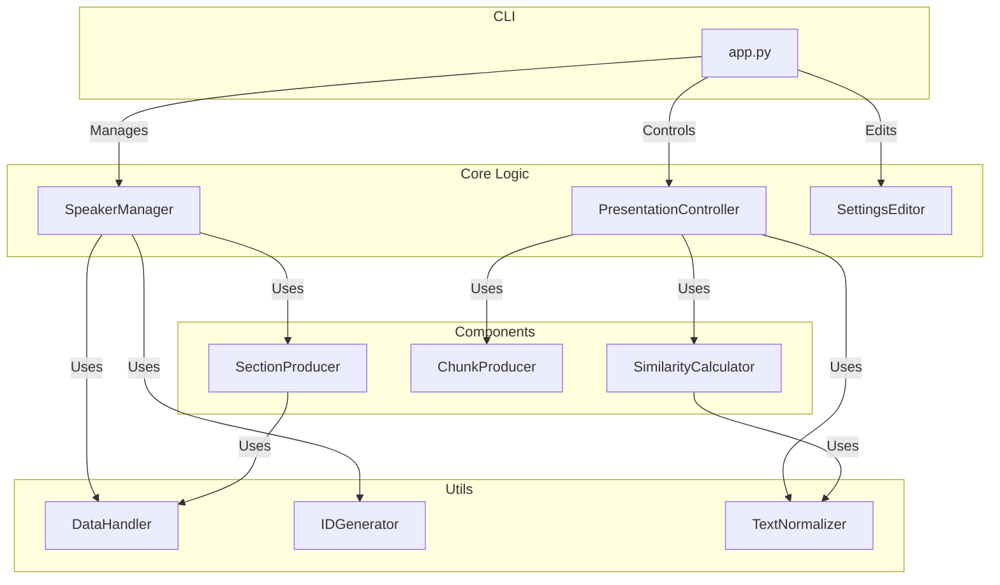

# moves Documentation - Architecture

This document provides a detailed overview of the moves application's architecture, including its directory structure, core components, and data flow.

## Directory Structure

The project is organized into the following main directories:

- **`app.py`**: The main entry point for the command-line interface (CLI), built using the Typer library.
- **`src/`**: Contains the core logic of the application.
  - **`core/`**: The heart of the application, containing the main business logic.
    - **`components/`**: Reusable components used by the core modules, such as the `SimilarityCalculator` and `SectionProducer`.
      - **`ml_models/`**: Directory for storing the machine learning models used for speech-to-text and semantic similarity.
      - **`similarity_units/`**: Contains the individual phonetic and semantic comparison logic.
    - **`presentation_controller.py`**: Manages the live presentation control, including audio processing and slide navigation.
    - **`settings_editor.py`**: Handles the reading and writing of application settings.
    - **`speaker_manager.py`**: Manages speaker profiles, including adding, editing, processing, and deleting speakers.
  - **`data/`**: Contains data models, templates, and instructions for the application.
    - **`models.py`**: Defines the Pydantic data models used throughout the application.
    - **`settings_template.yaml`**: The template for the application's settings file.
    - **`llm_instruction.md`**: The system prompt used for the large language model (LLM) when generating sections.
  - **`utils/`**: A collection of utility functions for tasks like data handling, ID generation, and text normalization.
- **`docs/`**: Contains all the documentation for the project.

## Core Components

The application is built around a few key components that work together to provide its functionality.

## Data Flow

The data flow in moves can be broken down into two main processes: speaker processing and presentation control.

### Speaker Processing Data Flow

1.  The user initiates the `speaker process` command from the CLI.
2.  The `SpeakerManager` retrieves the speaker's profile, including the paths to their presentation and transcript files.
3.  The `SectionProducer` is called, which reads the content of the presentation (PDF) and transcript files.
4.  The extracted text from the presentation and the full transcript are sent to a large language model (LLM) along with a detailed system prompt (`llm_instruction.md`).
5.  The LLM returns a list of text segments, one for each slide, which are then saved as `sections.json` in the speaker's data directory.

### Presentation Control Data Flow

1.  The user starts the `presentation control` command from the CLI.
2.  The `PresentationController` loads the pre-generated `sections.json` for the selected speaker.
3.  The `ChunkProducer` generates all possible overlapping text "chunks" from the sections.
4.  The `PresentationController` starts listening to the microphone for the speaker's voice.
5.  The audio is processed in real-time by a streaming speech-to-text model, which outputs transcribed words.
6.  A sliding window of the most recent transcribed words is taken as the input for the `SimilarityCalculator`.
7.  The `SimilarityCalculator` compares this input text to a set of "candidate" chunks from the presentation, using both semantic and phonetic similarity.
8.  The best-matching chunk determines the current section of the presentation.
9.  If the best-matching section is different from the current section, the `PresentationController` sends keyboard commands (arrow keys) to navigate to the correct slide.
10. The user can manually override the automatic navigation at any time using the keyboard.
