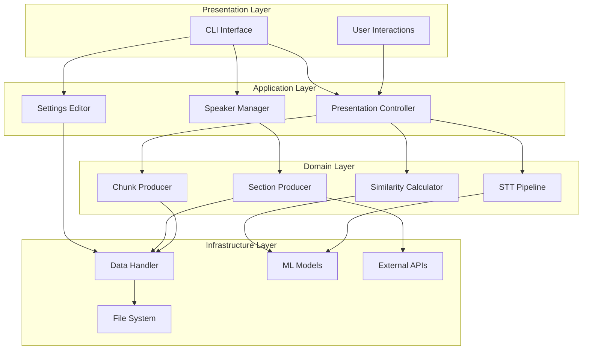
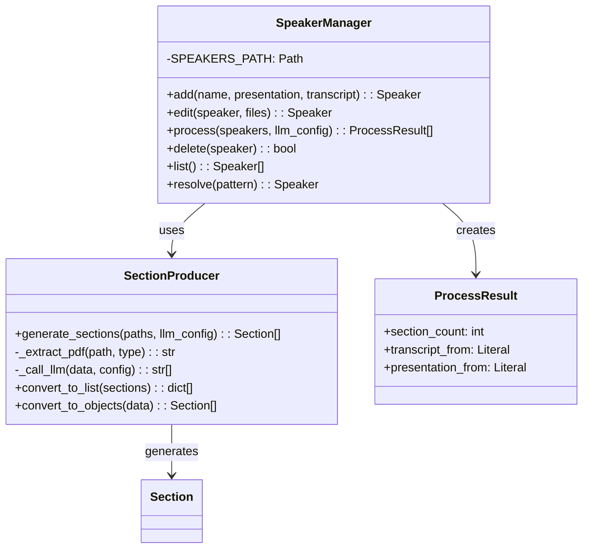
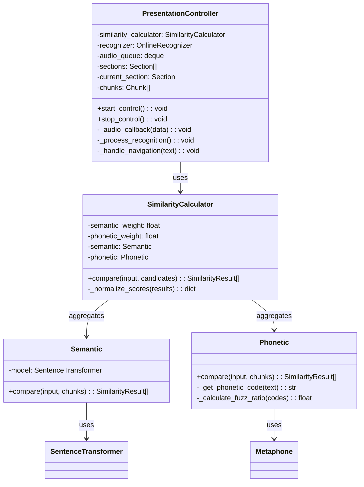
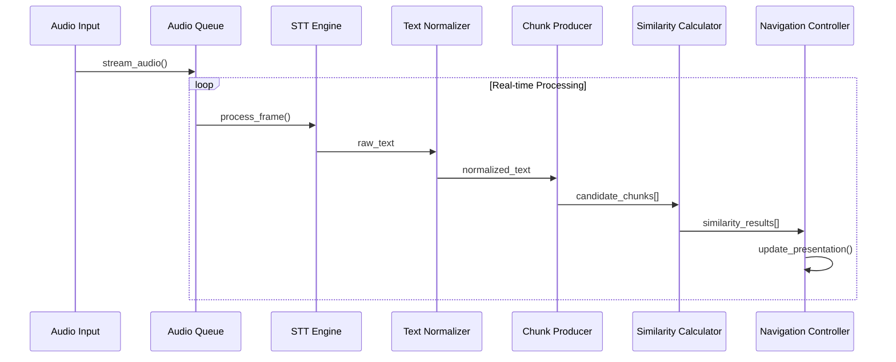
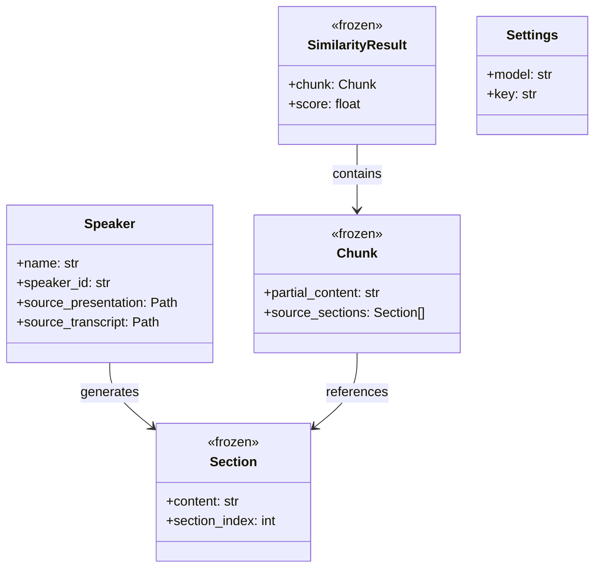

# Moves - System Architecture

## Architectural Overview

Moves implements a layered, event-driven architecture designed for real-time audio processing, intelligent content matching, and seamless presentation control. The system follows domain-driven design principles with clear separation between data processing, business logic, and presentation layers.

### High-Level Architecture



## Component Architecture

### 1. Speaker Management Subsystem

**Architecture Pattern**: Factory + Repository + Async Pipeline

The Speaker Management subsystem implements a sophisticated content processing pipeline that transforms raw presentation materials into structured, searchable content segments through AI-powered analysis.



**Key Design Patterns:**
- **Async Processing**: Concurrent speaker processing with asyncio.gather()
- **Factory Method**: Dynamic section generation with configurable parameters
- **Repository Pattern**: Centralized speaker data persistence and retrieval
- **Strategy Pattern**: Pluggable PDF extraction methods (transcript vs presentation)

### 2. Presentation Control Subsystem

**Architecture Pattern**: Observer + Strategy + State Machine

The Presentation Control subsystem orchestrates real-time audio processing, speech recognition, and intelligent content matching through a multi-threaded, event-driven architecture.



**Threading Architecture:**
- **Main Thread**: UI interaction and keyboard control
- **Audio Thread**: Continuous audio capture and buffering  
- **Recognition Thread**: STT processing and text generation
- **Similarity Thread**: Content matching and navigation logic

### 3. Data Processing Pipeline

**Architecture Pattern**: Pipeline + Chain of Responsibility



## Data Architecture

### Storage Strategy

Moves implements a file-system based storage architecture with structured data organization and atomic operations:

```
~/.moves/
├── speakers/
│   └── {speaker_id}/
│       ├── speaker.json          # Speaker metadata  
│       ├── sections.json         # Generated sections
│       ├── presentation.pdf      # Local copy (optional)
│       └── transcript.pdf        # Local copy (optional)
└── settings.yaml                 # User configuration
```

### Data Models

**Domain Models**: Immutable value objects with clear boundaries



## Integration Architecture

### External System Integration

**LLM Integration**: Multi-provider support through LiteLLM abstraction
- Provider abstraction with unified API interface
- Structured output validation using Instructor + Pydantic
- Retry logic with exponential backoff and circuit breaker patterns
- Temperature and parameter configuration per model type

**Audio Processing Integration**: Hardware abstraction through SoundDevice + Sherpa-ONNX
- Cross-platform audio capture with configurable sample rates  
- ONNX model loading with quantization support
- Stream-based processing with configurable buffer sizes
- Multi-threaded audio pipeline with lock-free queues

**File System Integration**: Atomic operations with error handling
- Transactional file operations with rollback capability
- Path validation and sanitization
- Concurrent access protection with file locking
- Backup and recovery mechanisms for critical data

### API Design Patterns

**Command Pattern**: CLI operations with undo/redo support
**Factory Pattern**: Component instantiation with dependency injection  
**Observer Pattern**: Event-driven audio processing and recognition
**Strategy Pattern**: Pluggable similarity algorithms and LLM providers
**Template Method**: Configuration management with inheritance hierarchy

## Performance Architecture

### Optimization Strategies

**Memory Management**:
- LRU caching for phonetic codes and embeddings
- Circular buffers for audio data with configurable retention
- Lazy loading of ML models with singleton pattern
- Garbage collection optimization for real-time processing

**Computational Efficiency**:
- Batch processing for similarity calculations
- ONNX quantization for model inference acceleration  
- Parallel processing with asyncio for I/O-bound operations
- Vectorized operations using NumPy for mathematical computations

**Latency Optimization**:
- Stream-based audio processing with minimal buffering
- Pre-computed embeddings for static content
- Connection pooling for LLM API requests
- Predictive caching for frequently accessed data

## Security Architecture

### Data Protection
- Local-first data storage with user control
- API key encryption with system keychain integration
- File permission management with restricted access
- Input validation and sanitization for all user inputs

### Privacy Considerations
- Audio processing without external transmission
- LLM requests with content filtering and anonymization
- Local model storage for sensitive content processing
- Audit logging for data access and modifications