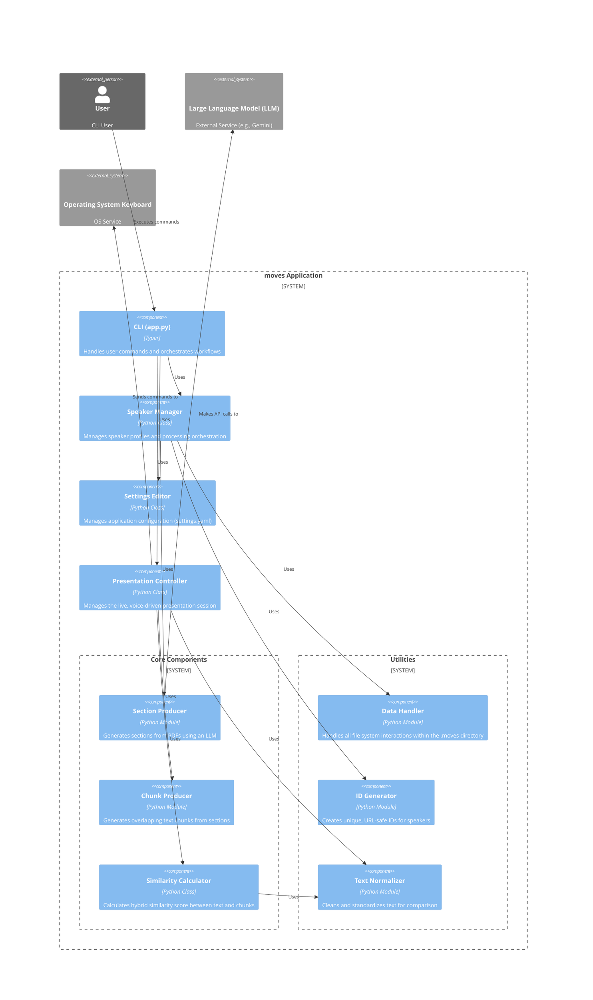

# System Architecture

This document provides a detailed overview of the **moves** application's architecture, its components, their interactions, and the flow of data through the system.

## Component Diagram (C4 Model - Level 2)

## Data Flow

The system operates on two primary data flows: the asynchronous **Speaker Processing Flow** and the real-time **Presentation Control Flow**.

### Speaker Processing Data Flow

This flow is responsible for preparing the necessary data for a live presentation. It is initiated by the `speaker process` command.

1.  **Initiation**: The `SpeakerManager` receives a list of speakers to process.
2.  **File Handling**: For each speaker, it copies the source presentation and transcript PDFs into a local, structured directory managed by the `DataHandler`.
3.  **Text Extraction**: The `SectionProducer` uses the `PyMuPDF` library to extract raw text from both the presentation and transcript PDFs.
4.  **LLM Invocation**: The extracted texts are sent to a configured Large Language Model (LLM) via the `LiteLLM` and `Instructor` libraries. The `llm_instruction.md` prompt guides the LLM to align the transcript with the presentation slides.
5.  **Structured Data Reception**: The `Instructor` library ensures the LLM's response is a well-formed JSON object containing a list of `Section` contents.
6.  **Data Persistence**: The `SpeakerManager` saves the generated `Section` objects to a `sections.json` file within the speaker's data directory.

### Presentation Control Data Flow

This flow executes during a live presentation, initiated by the `presentation control` command.

1.  **Initialization**: The `PresentationController` loads the `sections.json` file for the selected speaker.
2.  **Chunk Generation**: The `ChunkProducer` is called to generate all possible overlapping text `Chunks` from the loaded `Sections`. This creates a comprehensive set of comparison targets.
3.  **Audio Capture**: The controller uses the `sounddevice` library to capture audio from the default microphone in small frames.
4.  **Streaming STT**: The audio frames are fed into a `sherpa-onnx` `OnlineRecognizer` instance. This model performs real-time speech-to-text transcription.
5.  **Text Normalization**: The transcribed text is cleaned by the `TextNormalizer` (converted to lowercase, numbers to words, etc.).
6.  **Sliding Window**: The most recent 12 words of normalized text are held in a `deque` (a sliding window).
7.  **Candidate Selection**: The `ChunkProducer` selects a small subset of `candidate chunks` from sections surrounding the current presentation slide. This narrows the search space for efficiency.
8.  **Similarity Calculation**: The `SimilarityCalculator` compares the text from the sliding window against the candidate chunks using its hybrid semantic/phonetic algorithm.
9.  **Navigation Logic**: The chunk with the highest similarity score determines the most likely current section. If this section is different from the currently active one, the `PresentationController` uses the `pynput` library to dispatch arrow key presses to the OS, thus changing the slide.
10. **Manual Override**: A `pynput` `Listener` runs in a separate thread to capture user key presses (arrows for manual navigation, insert to pause/resume), allowing for immediate user intervention.