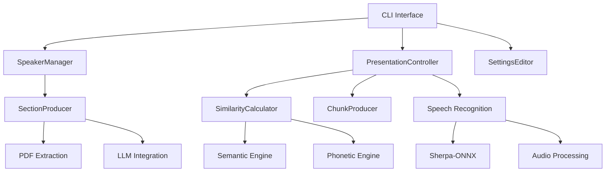

# System Architecture

## Overview

The Moves system is designed as a modular, event-driven architecture that processes voice input in real-time to control presentation navigation. The system combines multiple AI technologies to achieve robust, low-latency speech recognition and content matching.

## High-Level Architecture

```
┌─────────────────────────────────────────────────────────────────────────────────┐
│                                Moves System                                     │
├─────────────────────────────────────────────────────────────────────────────────┤
│                                                                                 │
│  ┌─────────────────┐    ┌─────────────────────────────────────────────────────┐ │
│  │   CLI Layer     │    │                Core System                          │ │
│  │   (app.py)      │    │                                                     │ │
│  │                 │    │  ┌─────────────────┐  ┌─────────────────────────┐   │ │
│  │ • speaker       │◄───┤  │ SpeakerManager  │  │  PresentationController │   │ │
│  │ • presentation  │    │  │                 │  │                         │   │ │
│  │ • settings      │    │  │ • add()         │  │ • control()             │   │ │
│  └─────────────────┘    │  │ • process()     │  │ • navigate()            │   │ │
│                         │  │ • list()        │  │ • listen()              │   │ │
│                         │  └─────────────────┘  └─────────────────────────┘   │ │
│                         │           │                       │                 │ │
│                         │           ▼                       ▼                 │ │
│                         │  ┌─────────────────┐  ┌─────────────────────────┐   │ │
│                         │  │ SectionProducer │  │   SimilarityCalculator  │   │ │
│                         │  │                 │  │                         │   │ │
│                         │  │ • extract_pdf() │  │ • compare()             │   │ │
│                         │  │ • call_llm()    │  │ • semantic + phonetic   │   │ │
│                         │  │ • generate()    │  └─────────────────────────┘   │ │
│                         │  └─────────────────┘                              │ │
│                         └─────────────────────────────────────────────────────┘ │
│                                                                                 │
├─────────────────────────────────────────────────────────────────────────────────┤
│                            External Dependencies                                │
├─────────────────────────────────────────────────────────────────────────────────┤
│                                                                                 │
│  ┌─────────────────┐  ┌─────────────────┐  ┌─────────────────┐                │
│  │   Speech Input  │  │   LLM Services  │  │   ML Models     │                │
│  │                 │  │                 │  │                 │                │
│  │ • Sherpa-ONNX   │  │ • OpenAI        │  │ • ONNX Models   │                │
│  │ • sounddevice   │  │ • Anthropic     │  │ • Transformers  │                │
│  │ • Real-time STT │  │ • Google        │  │ • Embeddings    │                │
│  └─────────────────┘  └─────────────────┘  └─────────────────┘                │
│                                                                                 │
└─────────────────────────────────────────────────────────────────────────────────┘
```

## Data Flow Architecture

### 1. Content Processing Pipeline

```
PDF Files ──┐
            │
┌───────────▼──────────┐    ┌─────────────┐    ┌──────────────┐    ┌─────────────┐
│     PDF Extraction   │───▶│ LLM Service │───▶│  Sections    │───▶│  Storage    │
│  • Presentation PDF  │    │             │    │ Generation   │    │ (~/.moves)  │
│  • Transcript PDF    │    │ • Alignment │    │              │    │             │
│  • Text Extraction   │    │ • Synthesis │    │ • JSON Data  │    │ • speaker/  │
└──────────────────────┘    └─────────────┘    └──────────────┘    └─────────────┘
```

### 2. Real-time Control Pipeline

```
Microphone ──┐
             │
┌────────────▼─────────┐    ┌──────────────┐    ┌─────────────┐    ┌──────────────┐
│   Speech Recognition │───▶│    Chunk     │───▶│ Similarity  │───▶│   Slide      │
│                      │    │  Producer    │    │ Calculator  │    │ Navigation   │
│ • Real-time STT      │    │              │    │             │    │              │
│ • Word Buffer        │    │ • Windowing  │    │ • Semantic  │    │ • Keyboard   │
│ • Sherpa-ONNX        │    │ • Candidate  │    │ • Phonetic  │    │   Control    │
└──────────────────────┘    └──────────────┘    └─────────────┘    └──────────────┘
```

## Component Interactions

### Core Component Relationships



## Threading and Concurrency Model

The system uses a multi-threaded architecture for real-time processing:

### Thread Architecture

```
Main Thread ──────────┬─── CLI Operations
                      │
                      ├─── Audio Input Thread ──── sounddevice callback
                      │
                      ├─── Audio Processing Thread ──── Speech Recognition
                      │
                      ├─── Navigation Thread ──── Similarity Calculation
                      │
                      └─── Keyboard Listener Thread ──── Manual Controls
```

### Thread Communication

- **Audio Queue**: Circular buffer for raw audio data (maxlen=5)
- **Word Buffer**: Sliding window for recognized words (configurable window_size)
- **Event Flags**: Threading.Event for coordination (shutdown_flag, pause states)

## Data Storage Architecture

### File System Layout

```
~/.moves/
├── settings.yaml                 # Global configuration
├── speakers/                     # Speaker profiles
│   └── {speaker_id}/            # Individual speaker data
│       ├── speaker.json         # Speaker metadata
│       ├── presentation.pdf     # Local copy of presentation
│       ├── transcript.pdf       # Local copy of transcript
│       └── sections.json        # Generated sections
└── logs/                        # System logs (future)
```

### Data Models

```python
# Core Data Structures
@dataclass
class Section:
    content: str           # Text content for this section
    section_index: int     # Position in presentation

@dataclass  
class Chunk:
    partial_content: str          # Windowed text content
    source_sections: list[Section] # References to source sections

@dataclass
class SimilarityResult:
    chunk: Chunk          # Matched chunk
    score: float          # Confidence score (0.0-1.0)

@dataclass
class Speaker:
    name: str             # Display name
    speaker_id: str       # Unique identifier
    source_presentation: Path  # Original presentation file
    source_transcript: Path    # Original transcript file
```

## Communication Patterns

### 1. Command Pattern
- CLI commands delegate to appropriate managers
- Each manager handles specific domain responsibilities

### 2. Observer Pattern  
- Audio processing notifies navigation thread
- Similarity results trigger navigation events

### 3. Pipeline Pattern
- Audio → Recognition → Chunking → Similarity → Navigation
- Each stage processes and forwards data

## Performance Considerations

### Real-time Processing Requirements

- **Audio Latency**: < 100ms frame duration
- **Recognition Latency**: Target < 500ms end-to-end
- **Similarity Calculation**: Optimized with caching
- **Memory Usage**: Bounded queues and LRU caches

### Optimization Strategies

1. **Caching**: Phonetic codes and similarity calculations use LRU cache
2. **Preprocessing**: PDF extraction and section generation done offline
3. **Threading**: Non-blocking audio processing with dedicated threads
4. **Batching**: Efficient embedding calculation for semantic similarity

## Security Architecture

### API Key Management
- Settings stored in user's home directory (`~/.moves/`)
- No API keys in source code or logs
- Secure transmission to LLM providers

### Data Privacy
- Local storage of presentation materials
- No persistent audio storage
- User controls all data retention

## Error Handling Strategy

### Graceful Degradation
- Continue operation if one similarity engine fails
- Fallback to manual navigation if voice fails
- Robust file I/O with meaningful error messages

### Recovery Mechanisms
- Automatic retry for transient failures
- State preservation across restarts
- Comprehensive logging for debugging

## Extensibility Points

### Plugin Architecture (Future)
- Custom similarity engines
- Alternative speech recognition backends
- Additional navigation output methods

### Configuration
- Weighted similarity combination
- Adjustable window sizes and thresholds
- Multiple LLM provider support

## Dependencies and External Systems

### Core Dependencies
- **Sherpa-ONNX**: Speech recognition engine
- **sentence-transformers**: Semantic similarity
- **sounddevice**: Real-time audio capture
- **LiteLLM**: Multi-provider LLM interface
- **PyMuPDF**: PDF processing

### System Requirements
- **Audio System**: Hardware microphone support
- **Network**: Internet for LLM API calls
- **Storage**: Local disk for model files and data
- **Memory**: Sufficient for ML model loading

This architecture provides a solid foundation for real-time presentation control while maintaining modularity, performance, and reliability.