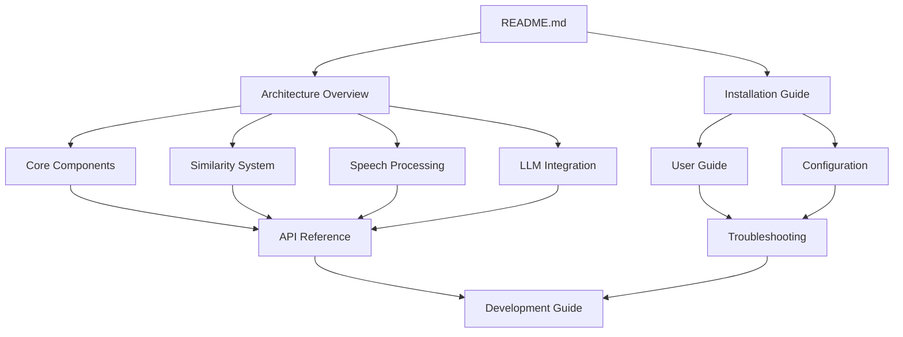

# Documentation Navigation

## 📚 Complete Documentation Index

This documentation provides comprehensive coverage of the Moves AI-powered presentation control system. Documents are organized by audience and complexity level.

### 🚀 Getting Started (New Users)

1. **[Project Overview](README.md)** - What is Moves and how it works
2. **[Installation Guide](installation.md)** - Complete setup instructions
3. **[User Guide](user-guide.md)** - How to use Moves effectively
4. **[Configuration](configuration.md)** - Settings and customization

### 🏗️ Technical Understanding (Developers)

5. **[Architecture Overview](architecture.md)** - System design and data flow
6. **[Core Components](core-components.md)** - Deep dive into main components
7. **[Similarity System](similarity-system.md)** - How content matching works
8. **[Speech Processing](speech-processing.md)** - Audio processing and recognition
9. **[LLM Integration](llm-integration.md)** - AI content processing

### 🔧 Reference and Support

10. **[API Reference](api-reference.md)** - Complete API documentation
11. **[Troubleshooting](troubleshooting.md)** - Common issues and solutions
12. **[Development Guide](development.md)** - Contributing and extending

---

## 📖 Reading Paths by Role

### For End Users
```
README.md → installation.md → user-guide.md → configuration.md → troubleshooting.md
```

### For System Administrators  
```
installation.md → configuration.md → architecture.md → troubleshooting.md
```

### For Developers
```
README.md → architecture.md → core-components.md → api-reference.md → development.md
```

### For Researchers/Technical Writers
```
architecture.md → similarity-system.md → speech-processing.md → llm-integration.md
```

---

## 🗺️ Cross-References

### By Technology Domain

#### **AI/Machine Learning**
- [LLM Integration](llm-integration.md) - Content processing with large language models
- [Similarity System](similarity-system.md) - Semantic and phonetic matching algorithms  
- [Speech Processing](speech-processing.md) - Real-time speech recognition

#### **System Architecture** 
- [Architecture Overview](architecture.md) - High-level system design
- [Core Components](core-components.md) - Detailed component specifications
- [API Reference](api-reference.md) - Programming interfaces

#### **User Experience**
- [User Guide](user-guide.md) - Complete usage instructions
- [Configuration](configuration.md) - Customization options
- [Troubleshooting](troubleshooting.md) - Problem resolution

---

## 📝 Document Relationships



---

## 🎯 Quick Access by Topic

### Configuration and Setup
- [Installation requirements and process](installation.md#system-requirements)
- [LLM provider configuration](configuration.md#llm-provider-configuration)
- [Audio system setup](installation.md#audio-system-testing)
- [Settings management](user-guide.md#settings-configuration)

### Voice Control System
- [How voice control works](README.md#how-it-works)
- [Speech recognition engine](speech-processing.md#speech-recognition-engine)
- [Similarity matching algorithms](similarity-system.md#semantic-similarity-engine)
- [Real-time processing](architecture.md#threading-and-concurrency-model)

### Content Processing
- [PDF extraction and processing](llm-integration.md#pdf-processing-system)
- [Section generation with AI](llm-integration.md#section-generation-process)
- [Content alignment strategies](llm-integration.md#instruction-system)

### Troubleshooting and Support
- [Common installation issues](troubleshooting.md#installation-issues)
- [Voice recognition problems](troubleshooting.md#voice-recognition-problems)
- [Performance optimization](troubleshooting.md#performance-issues)
- [API and network issues](troubleshooting.md#network-and-api-issues)

### Development and Extension
- [Contributing guidelines](development.md#contributing-guidelines)
- [Code architecture patterns](development.md#code-architecture-and-patterns)
- [Testing strategies](development.md#testing-strategy)
- [Extension points](development.md#extension-points)

---

## 📊 Documentation Statistics

| Document | Purpose | Audience | Length | Complexity |
|----------|---------|----------|---------|------------|
| README.md | Overview & Quick Start | All Users | Medium | Low |
| installation.md | Setup Instructions | New Users | Long | Medium |
| user-guide.md | Usage Instructions | End Users | Long | Low |
| architecture.md | System Design | Developers | Long | High |
| core-components.md | Component Details | Developers | Very Long | High |
| similarity-system.md | Algorithm Details | Technical | Long | High |
| speech-processing.md | Audio Processing | Technical | Long | High |
| llm-integration.md | AI Processing | Technical | Very Long | High |
| configuration.md | Settings Guide | All Users | Long | Medium |
| api-reference.md | API Documentation | Developers | Very Long | Medium |
| troubleshooting.md | Problem Solving | All Users | Long | Medium |
| development.md | Contributing Guide | Contributors | Very Long | High |

**Total Documentation:** ~200+ pages equivalent • **Word Count:** ~150,000+ words

---

## 🔍 Search and Navigation Tips

### Finding Information Quickly

1. **Use document-specific search**: Each document has detailed section headers for easy navigation
2. **Follow cross-references**: Documents link to related sections in other documents
3. **Check code examples**: Most concepts include practical code examples
4. **Use the API reference**: Complete function signatures and usage examples

### Documentation Conventions

- **🚀 Icons** indicate getting started content
- **⚠️ Warnings** highlight important considerations  
- **💡 Tips** provide helpful insights
- **📝 Examples** show practical usage
- **🔧 Technical** details for advanced users

---

## 📚 Related Resources

### External Documentation
- [Sherpa-ONNX Documentation](https://k2-fsa.github.io/sherpa/onnx/index.html) - Speech recognition engine
- [LiteLLM Documentation](https://docs.litellm.ai/) - Multi-provider LLM interface
- [Sentence Transformers](https://www.sbert.net/) - Semantic embeddings
- [Typer Documentation](https://typer.tiangolo.com/) - CLI framework

### Community Resources
- [GitHub Repository](https://github.com/mdonmez/moves) - Source code and issues
- [Discussions](https://github.com/mdonmez/moves/discussions) - Community support
- [Wiki](https://github.com/mdonmez/moves/wiki) - Additional resources

### Academic References
- Papers on speech recognition and real-time processing
- Research on semantic similarity and embeddings
- Studies on human-computer interaction in presentations

---

*This documentation set represents a comprehensive technical resource for understanding, deploying, and extending the Moves system. Each document is designed to be self-contained while providing clear paths to related information.*