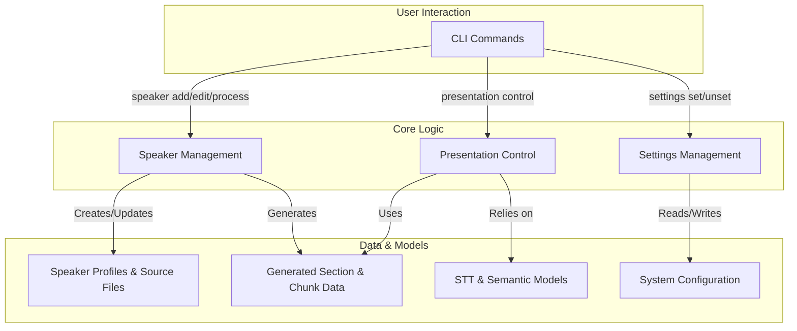
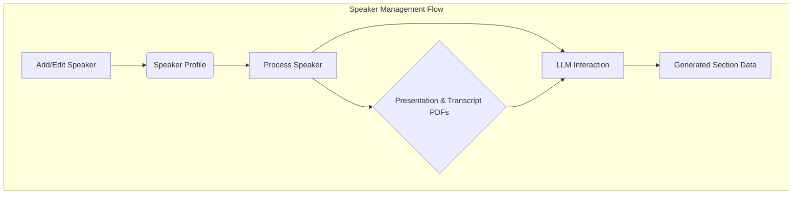
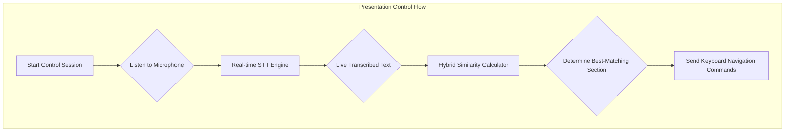
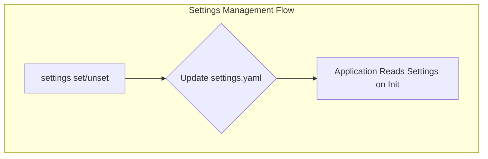

# System Overview

**moves** is an intelligent presentation control system designed to automate slide navigation by synchronizing with a speaker's live narration. It achieves this through a combination of AI-driven content analysis and a real-time audio processing pipeline.

The application is architecturally divided into three primary domains:

- **Data & Speaker Management**: Governs the creation, storage, and processing of speaker profiles and their associated presentation/transcript files.
- **Live Presentation Control**: Manages the real-time, voice-controlled navigation of presentations.
- **System Configuration**: Allows for the management of system-level settings, primarily the AI model and API keys used for content analysis.

---

---

## Speaker & Data Management

This domain handles the preparatory analysis required for live control. It allows users to register speakers and associate them with their presentation (PDF) and transcript (PDF) files. The core of this domain is the **processing** step, which uses a Large Language Model (LLM) to intelligently segment the transcript into `Sections` that correspond to each slide of the presentation. This creates the foundational data for the live system.

- **Speaker Profiles**: Each speaker is represented by a profile containing their name, a unique ID, and paths to their source files.
- **AI-Powered Section Generation**: The system sends the extracted text from the presentation and transcript to an LLM, which, guided by a detailed prompt, aligns the transcript content with the presentation slides.
- **Data Persistence**: All speaker data, including profiles and the generated `Section` data, is stored locally in a dedicated application directory.

---

## Live Presentation Control

This is the real-time component of the application. Once a speaker's data has been processed, a `control` session can be initiated. The system listens to the speaker's voice via a microphone and uses the pre-generated `Section` data to determine the current position in the presentation. As the speaker progresses, the application automatically sends keyboard commands (arrow keys) to navigate the presentation software.

- **Streaming Speech-to-Text**: A low-latency, streaming STT model transcribes the speaker's voice in real time.
- **Hybrid Similarity Matching**: The transcribed text is continuously compared against the `Section` content using a weighted algorithm that combines semantic (meaning) and phonetic (sound) similarity.
- **Automated Navigation**: Based on the best-matching text chunk, the system triggers slide navigation to keep the presentation synchronized with the speaker.
- **Manual Override**: The user retains full manual control via the keyboard to navigate or to pause/resume the automatic navigation.

---

## System Configuration

This component provides a simple interface for managing the application's settings. The primary configurable parameters are the choice of Large Language Model (LLM) for content processing and the associated API key.

- **Model Selection**: Users can specify which `LiteLLM`-compatible model they wish to use for section generation.
- **API Key Management**: Users can set, update, and unset the API key for the selected LLM.
- **Configuration File**: Settings are persisted in a `settings.yaml` file, with a template providing default values.

