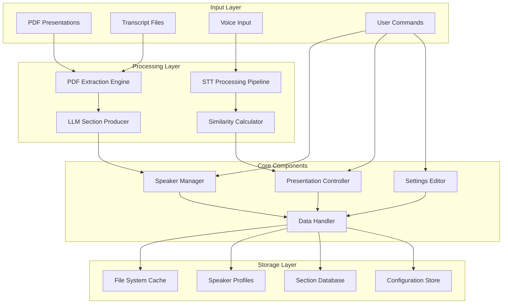
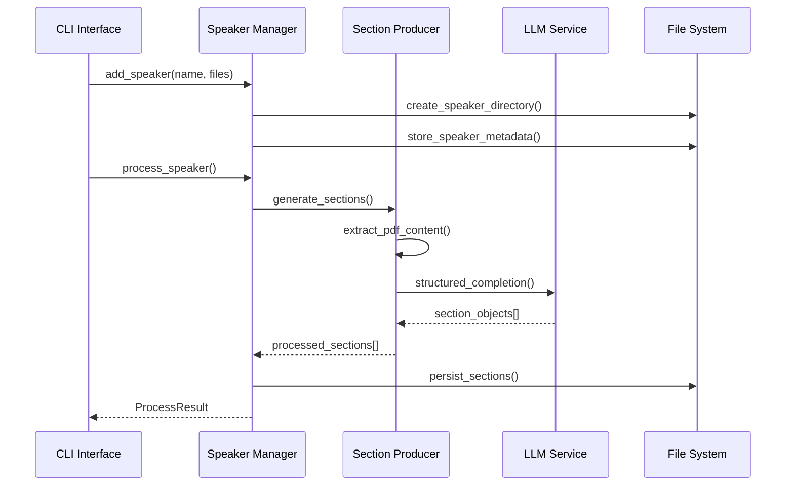
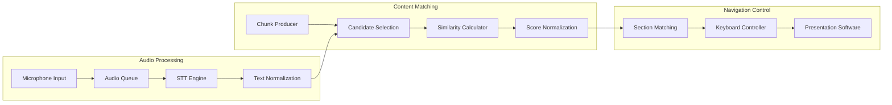
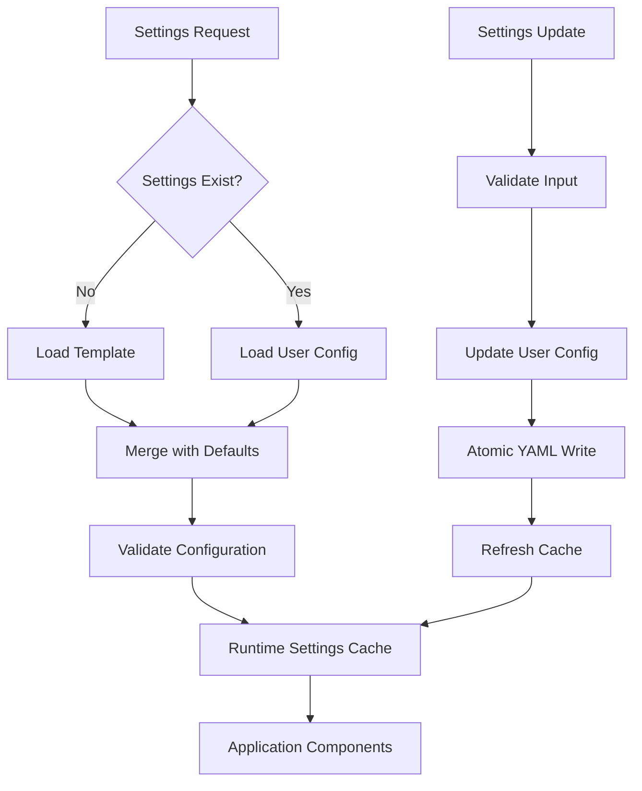

# Moves - Technical Overview

Moves is a sophisticated AI-powered presentation control system that enables voice-controlled navigation through presentations using advanced natural language processing, speech recognition, and semantic similarity matching. The system implements a multi-layered architecture combining PDF processing, large language model integration, real-time speech-to-text conversion, and intelligent content matching algorithms.

## System Architecture

Moves employs a modular, event-driven architecture with three primary operational domains:

- **Speaker Management Pipeline**: AI-powered content processing and data ingestion
- **Real-time Presentation Control**: Voice-controlled navigation with ML-based matching
- **Configuration Management**: Template-driven settings with YAML persistence

---

## Speaker Management Pipeline

The speaker management subsystem orchestrates the ingestion, processing, and structuring of presentation content through a sophisticated AI-powered pipeline that transforms raw PDF documents into semantically-aware, navigable content sections.

**Core Operations:**
- **Multi-format PDF text extraction** with PyMuPDF-based content parsing
- **Asynchronous LLM processing** using instructor-enhanced structured output generation
- **Content segmentation** with slide-to-transcript alignment algorithms
- **Persistent storage management** with JSON-serialized speaker profiles
- **Concurrent processing** with asyncio-based parallel execution

**Data Flow Architecture:**
- PDF documents undergo OCR-enhanced text extraction with noise filtering
- Structured prompts guide LLM-based content segmentation using temperature-controlled generation
- Generated sections are validated against presentation slide count constraints
- Speaker profiles are persisted with source file tracking and processing metadata

---

## Real-time Presentation Control

The presentation control engine implements a real-time, multi-threaded system that processes continuous audio streams, performs speech-to-text conversion, and executes intelligent content matching to enable seamless voice-controlled presentation navigation.

**Technical Components:**
- **Sherpa-ONNX STT Engine**: High-performance, low-latency speech recognition with transducer architecture
- **Hybrid Similarity Matching**: Weighted combination of semantic embeddings and phonetic similarity scoring
- **Audio Processing Pipeline**: Circular buffer management with configurable frame rates and sample rates
- **Keyboard Automation**: System-level keystroke injection for presentation software control
- **Context-aware Chunking**: Sliding window text segmentation with section boundary optimization

**Processing Architecture:**
- Audio streams are captured at 16kHz with 0.1s frame duration for optimal latency-accuracy balance
- Speech recognition utilizes ONNX-quantized models with greedy search decoding for real-time performance
- Text normalization applies Unicode NFC normalization, emoji removal, and number-to-word conversion
- Similarity calculation combines sentence transformer embeddings (40% weight) with metaphone-based phonetic matching (60% weight)

---

## Configuration Management

The settings subsystem implements a hierarchical configuration architecture with template-driven defaults and user-specific overrides, supporting dynamic reconfiguration of LLM endpoints, API credentials, and system parameters.

**Configuration Hierarchy:**
- **Template Layer**: Default settings with type validation and constraint definition
- **User Layer**: Persistent overrides with YAML serialization and atomic updates  
- **Runtime Layer**: In-memory configuration cache with lazy loading optimization

**Managed Settings:**
- **LLM Configuration**: Model selection, API endpoint configuration, temperature parameters
- **API Credentials**: Secure key management with environment variable fallback
- **Processing Parameters**: Chunk window sizes, similarity thresholds, audio settings

---

## Advanced AI/ML Integration

### Large Language Model Pipeline

The LLM integration employs instructor-enhanced structured output generation with Pydantic model validation for reliable content segmentation:

**Implementation Details:**
- **LiteLLM Integration**: Multi-provider LLM support with unified API interface
- **Structured Output**: Instructor-based response parsing with JSON mode validation
- **Content Alignment**: Slide-to-transcript mapping with semantic coherence constraints
- **Error Handling**: Comprehensive retry logic with exponential backoff and circuit breaker patterns

### Semantic Similarity Engine  

The similarity calculation system combines multiple similarity metrics through a weighted scoring architecture:

**Semantic Component (40% weight):**
- Sentence transformer embeddings with normalized cosine similarity
- Pre-trained multilingual models for cross-language support
- Batch processing optimization for candidate comparison

**Phonetic Component (60% weight):**
- Metaphone phonetic encoding with fuzzy string matching
- RapidFuzz-based edit distance calculation with configurable thresholds
- LRU caching for phonetic code optimization

### Speech-to-Text Processing

**Sherpa-ONNX Architecture:**
- Transducer-based neural network architecture with encoder-decoder-joiner components
- INT8 quantization for optimal inference performance
- Streaming recognition with configurable beam search parameters
- Multi-threaded processing with lock-free audio queue management
