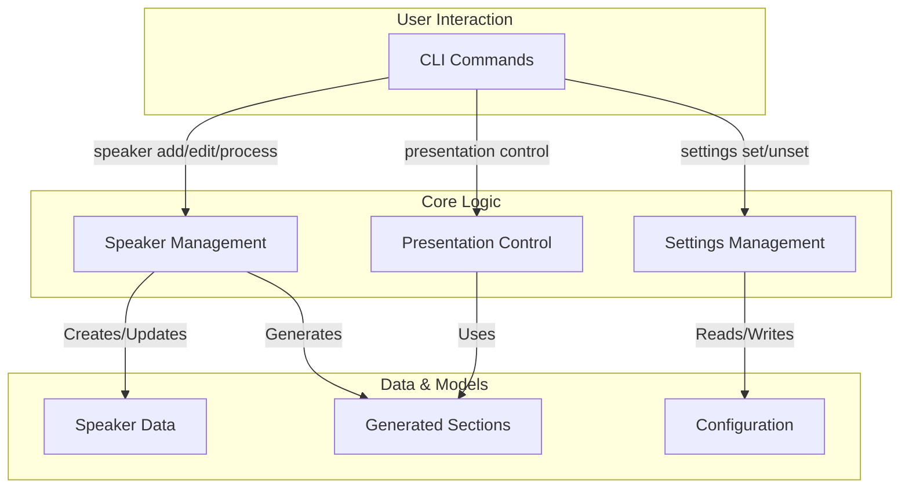
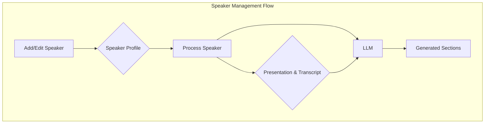
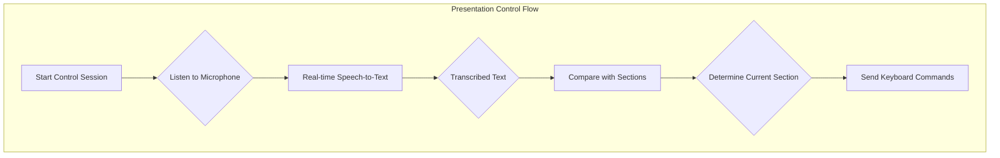
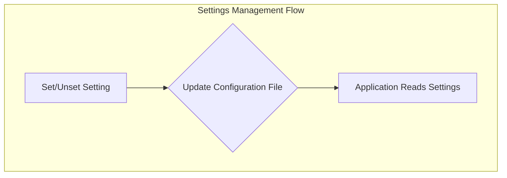

# moves Documentation - Overview

moves is an intelligent presentation management and control application that synchronizes slide transitions with a speaker's live narration. It achieves this by managing speaker profiles, analyzing presentation content and transcripts, and tracking the speaker's voice in real time to automatically advance slides.

The application is divided into three core functional areas:

- **Managing Speakers**: Handles the creation, modification, and processing of speaker profiles, which include their presentation and transcript files.
- **Controlling Presentations**: Provides live, voice-controlled navigation of presentations during a speaking engagement.
- **Editing Settings**: Allows for the configuration of system-level settings, such as the AI model and API keys used for processing.

---

---

## Managing Speakers

This area of the application is responsible for all aspects of speaker and presentation data management. It allows users to register new speakers, associate them with their presentation and transcript files, and process these files to generate the necessary data for live presentation control. The processing step uses a large language model (LLM) to intelligently segment the transcript into sections that correspond to each slide of the presentation.

- **Speaker Profiles**: Each speaker has a profile containing their name, a unique ID, and paths to their source presentation and transcript files.
- **Data Processing**: The application processes the presentation and transcript to create structured "sections" that map the spoken content to the visual slides.
- **Storage**: All speaker data, including profiles and generated sections, is stored locally on the user's machine.

---

## Controlling Presentations

This is the live, real-time component of the application. Once a speaker has been processed, the user can initiate a "control" session. During this session, the application listens to the speaker's voice through a microphone and uses the pre-generated sections to determine the current position in the presentation. As the speaker moves through their content, the application automatically sends keyboard commands (left and right arrow keys) to advance or go back through the slides.

- **Real-time Transcription**: A streaming speech-to-text model transcribes the speaker's words in real time.
- **Similarity Matching**: The transcribed text is continuously compared against the content of the generated sections to find the most likely current position.
- **Automated Navigation**: Based on the similarity matching, the application triggers slide navigation.
- **Manual Override**: The speaker can manually navigate slides using the arrow keys, and can pause or resume the automatic navigation.

---

## Editing Settings

This component allows the user to configure the application's settings. The primary settings are the selection of the large language model (LLM) used for processing speaker presentations and the API key for that model.

- **Model Selection**: Users can specify which LLM they want to use for the section generation process.
- **API Key Management**: Users can set and update the API key required for the selected LLM.
- **Configuration File**: Settings are stored in a YAML file, with a template providing default values.

