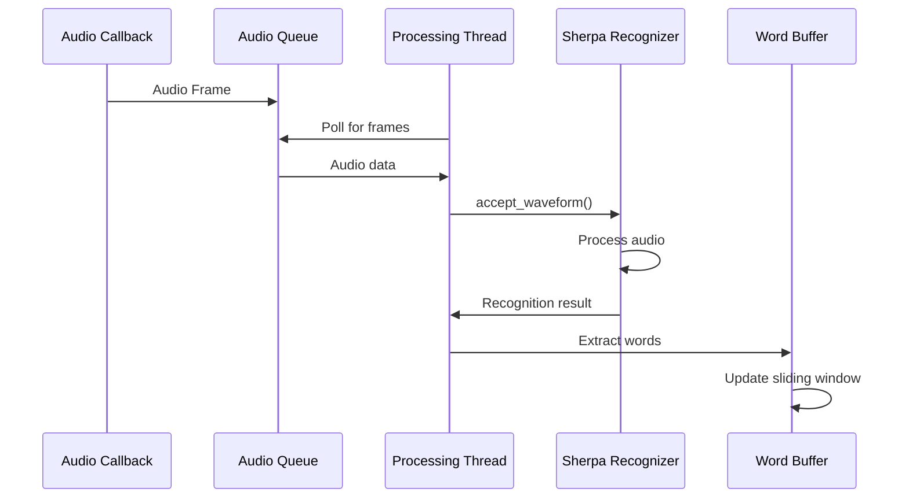

# Speech Processing

## Overview

The speech processing system in Moves handles real-time audio capture, speech recognition, and word buffer management. It transforms continuous microphone input into structured text that can be matched against presentation content for navigation control.

## Architecture Overview

```
┌─────────────────────────────────────────────────────────────────────────────────┐
│                           Speech Processing Pipeline                            │
├─────────────────────────────────────────────────────────────────────────────────┤
│                                                                                 │
│  ┌─────────────┐    ┌─────────────┐    ┌─────────────┐    ┌─────────────────┐   │
│  │ Microphone  │───▶│   Audio     │───▶│   Speech    │───▶│    Word Buffer  │   │
│  │   Input     │    │ Processing  │    │ Recognition │    │  Management     │   │
│  │             │    │             │    │             │    │                 │   │
│  │ • Real-time │    │ • Buffering │    │ • Sherpa    │    │ • Sliding       │   │
│  │ • 16kHz     │    │ • Framing   │    │ • ONNX      │    │   Window        │   │
│  │ • Mono      │    │ • Threading │    │ • Streaming │    │ • Normalization │   │
│  └─────────────┘    └─────────────┘    └─────────────┘    └─────────────────┘   │
│                                                                                 │
├─────────────────────────────────────────────────────────────────────────────────┤
│                              Threading Model                                   │
├─────────────────────────────────────────────────────────────────────────────────┤
│                                                                                 │
│  Main Thread          Audio Thread         Processing Thread                   │
│  ┌─────────────┐      ┌─────────────┐      ┌─────────────────┐                │
│  │   Stream    │      │   Audio     │      │   Recognition   │                │
│  │ Management  │◄────▶│   Queue     │◄────▶│   Processing    │                │
│  │             │      │ (Circular)  │      │                 │                │
│  └─────────────┘      └─────────────┘      └─────────────────┘                │
│                                                                                 │
└─────────────────────────────────────────────────────────────────────────────────┘
```

## Audio Capture System

### Hardware Interface

The system interfaces with the operating system's audio subsystem to capture microphone input in real-time.

#### Audio Configuration
```python
# Audio stream parameters
SAMPLE_RATE = 16000        # 16kHz sampling (optimal for speech)
FRAME_DURATION = 0.1       # 100ms frames (low latency)
CHANNELS = 1               # Mono input
DTYPE = "float32"          # 32-bit floating point
BLOCKSIZE = int(SAMPLE_RATE * FRAME_DURATION)  # 1600 samples per frame
```

#### Stream Setup
```python
def control(self):
    blocksize = int(self.sample_rate * self.frame_duration)
    
    with sd.InputStream(
        samplerate=self.sample_rate,
        blocksize=blocksize,
        dtype="float32",
        channels=1,
        callback=lambda indata, *_: self.audio_queue.append(indata[:, 0].copy()),
        latency="low",
        device=self.selected_mic,
    ):
        # Main control loop
        while not self.shutdown_flag.is_set():
            sd.sleep(20)  # 20ms sleep for efficiency
```

### Audio Queue Management

#### Circular Buffer Design
```python
from collections import deque

class PresentationController:
    def __init__(self, ...):
        # Circular buffer for audio frames
        self.audio_queue = deque(maxlen=5)  # Keep last 5 frames (500ms)
```

**Queue Characteristics:**
- **Size**: Fixed maximum of 5 frames (500ms of audio)
- **Type**: Circular buffer (old frames automatically discarded)
- **Thread Safety**: deque operations are atomic in Python
- **Memory**: Bounded memory usage prevents accumulation

#### Callback Function
```python
def audio_callback(indata, frames, time, status):
    """
    Called by sounddevice for each audio frame
    - indata: numpy array of audio samples
    - frames: number of samples in this frame  
    - time: timestamp information
    - status: any audio system status flags
    """
    # Extract mono channel and copy to prevent memory issues
    audio_frame = indata[:, 0].copy()
    
    # Add to thread-safe circular queue
    self.audio_queue.append(audio_frame)
```

### Device Selection

#### Default Device Usage
```python
def __init__(self, ...):
    # Automatically use system default input device
    self.selected_mic = sd.default.device[0]  # Input device index
```

#### Device Discovery
```python
# Query available audio devices
import sounddevice as sd

def list_audio_devices():
    devices = sd.query_devices()
    for i, device in enumerate(devices):
        if device['max_input_channels'] > 0:  # Input device
            print(f"Device {i}: {device['name']}")
            print(f"  Channels: {device['max_input_channels']}")
            print(f"  Sample Rate: {device['default_samplerate']}")
```

## Speech Recognition Engine

### Sherpa-ONNX Integration

Moves uses Sherpa-ONNX for real-time speech recognition, providing high-quality, low-latency speech-to-text conversion.

#### Model Configuration
```python
from sherpa_onnx import OnlineRecognizer

def __init__(self, ...):
    self.recognizer = OnlineRecognizer.from_transducer(
        tokens=str(Path("src/core/components/ml_models/stt/tokens.txt")),
        encoder=str(Path("src/core/components/ml_models/stt/encoder.int8.onnx")),
        decoder=str(Path("src/core/components/ml_models/stt/decoder.int8.onnx")),
        joiner=str(Path("src/core/components/ml_models/stt/joiner.int8.onnx")),
        num_threads=8,
        decoding_method="greedy_search",
    )
    
    # Create recognition stream
    self.stream = self.recognizer.create_stream()
```

#### Model Components

**Transducer Architecture:**
- **Encoder**: Processes audio features into internal representations
- **Decoder**: Generates text predictions from encoder output  
- **Joiner**: Combines encoder and decoder to produce final text
- **Tokens**: Vocabulary file mapping text to model tokens

**Model Characteristics:**
- **Format**: ONNX (Open Neural Network Exchange)
- **Quantization**: INT8 for reduced memory usage and faster inference
- **Language**: Primarily English (can be extended with different models)
- **Size**: ~200MB total for all model files

### Real-Time Processing

#### Audio Processing Thread
```python
def process_audio(self):
    """
    Dedicated thread for continuous audio processing
    Runs until shutdown_flag is set
    """
    while not self.shutdown_flag.is_set():
        if self.audio_queue:
            # Get audio frame from queue
            audio_data = self.audio_queue.popleft()
            
            # Convert to format expected by recognizer
            # sounddevice provides float32, recognizer expects specific format
            samples = (audio_data * 32768).astype(np.float32)
            
            # Feed to recognition stream
            self.stream.accept_waveform(self.sample_rate, samples)
            
            # Check if recognizer has decoded any words
            if self.recognizer.is_ready(self.stream):
                result = self.recognizer.get_result(self.stream)
                if result.text.strip():
                    # Extract individual words and add to buffer
                    words = result.text.strip().split()
                    for word in words:
                        self.recent_words.append(word)
                
                # Reset stream for next segment
                self.recognizer.reset(self.stream)
        
        time.sleep(0.01)  # 10ms processing cycle
```

#### Recognition Flow



### Word Buffer Management

#### Sliding Window Implementation
```python
from collections import deque

class PresentationController:
    def __init__(self, ..., window_size: int = 12):
        # Sliding window of recent words
        self.recent_words: deque[str] = deque(maxlen=window_size)
        self.previous_recent_words: list[str] = []
```

**Buffer Characteristics:**
- **Type**: Circular buffer with fixed maximum size
- **Default Size**: 12 words (configurable)
- **Behavior**: Oldest words automatically removed when buffer full
- **Thread Safety**: deque operations are atomic

#### Word Processing Pipeline
```python
def process_recognition_result(self, result_text: str):
    """
    Process recognition result and update word buffer
    """
    if result_text.strip():
        # Split into individual words
        words = result_text.strip().split()
        
        for word in words:
            # Apply text normalization
            normalized_word = text_normalizer.normalize_text(word)
            
            if normalized_word:  # Skip empty words after normalization
                self.recent_words.append(normalized_word)
```

#### Buffer State Management
```python
def get_recent_words_text(self) -> str:
    """
    Get current buffer content as single string
    """
    return " ".join(self.recent_words)

def has_buffer_changed(self) -> bool:
    """
    Check if buffer content has changed since last check
    """
    current_words = list(self.recent_words)
    if current_words != self.previous_recent_words:
        self.previous_recent_words = current_words.copy()
        return True
    return False
```

## Text Normalization

### Purpose and Importance

Text normalization ensures consistent format between recognized speech and stored presentation content, improving similarity matching accuracy.

### Normalization Pipeline

#### Implementation
```python
def normalize_text(text: str) -> str:
    """
    Comprehensive text normalization for speech recognition
    """
    # Unicode normalization
    text = unicodedata.normalize("NFC", text.lower())
    
    # Remove emojis and special Unicode characters
    text = re.sub(
        r"[\U0001f600-\U0001f64f\U0001f300-\U0001f5ff\U0001f680-\U0001f6ff"
        r"\U0001f1e0-\U0001f1ff\U00002702-\U000027b0\U000024c2-\U0001f251]+",
        "",
        text,
        flags=re.UNICODE,
    )
    
    # Normalize quotation marks
    text = text.translate(str.maketrans({
        "'": "'",  "‚": "'",  "‛": "'",  "'": "'",
        """: '"',  "„": '"',  "‟": '"',  """: '"',
    }))
    
    # Convert numbers to words
    text = re.sub(r"\d+", lambda m: num2words(m.group(0)).replace("-", " "), text)
    
    # Remove punctuation (except apostrophes, quotes, backticks)
    text = re.sub(r"[^\w\s'\"``]", " ", text, flags=re.UNICODE)
    
    # Normalize whitespace
    return re.sub(r"\s+", " ", text).strip()
```

#### Normalization Examples

**Input Processing:**
```
Original: "Hello! I'll discuss AI's 123 features… 😊"
Lowercase: "hello! i'll discuss ai's 123 features… 😊"
Emoji removal: "hello! i'll discuss ai's 123 features…"  
Quote normalization: "hello! i'll discuss ai's 123 features…"
Number conversion: "hello! i'll discuss ai's one hundred twenty three features…"
Punctuation removal: "hello i'll discuss ai's one hundred twenty three features"
Whitespace normalization: "hello i'll discuss ai's one hundred twenty three features"
```

**Consistency Benefits:**
- **Speech Recognition**: "one hundred twenty three" → "123" → "one hundred twenty three"
- **Quotation Marks**: Various Unicode quotes → standard ASCII quotes
- **Punctuation**: Removes noise that doesn't affect meaning
- **Case**: Consistent lowercase for matching

## Performance Optimization

### Latency Minimization

#### Frame-Based Processing
- **Frame Size**: 100ms frames balance latency and processing efficiency
- **Processing Cycle**: 10ms cycle for responsive audio processing
- **Recognition Latency**: ~200-300ms from audio to text
- **Total Latency**: <500ms from speech to navigation action

#### Thread Efficiency
```python
# Minimize CPU usage in main control loop
while not self.shutdown_flag.is_set():
    sd.sleep(20)  # 20ms sleep, yields CPU to other threads

# Efficient audio processing cycle  
while not self.shutdown_flag.is_set():
    if self.audio_queue:
        # Process available audio
        process_frame()
    time.sleep(0.01)  # 10ms processing cycle
```

### Memory Management

#### Bounded Data Structures
```python
# All queues and buffers have maximum sizes
self.audio_queue = deque(maxlen=5)           # 500ms of audio
self.recent_words = deque(maxlen=window_size) # 12 words default
```

#### Efficient Audio Handling
```python
# Copy audio data to prevent reference issues
audio_frame = indata[:, 0].copy()

# Convert efficiently to recognizer format
samples = (audio_data * 32768).astype(np.float32)
```

### Model Optimization

#### ONNX Runtime Benefits
- **Cross-Platform**: Consistent performance across operating systems
- **Optimization**: Automatic graph optimizations for speed
- **Quantization**: INT8 models reduce memory usage by ~4x
- **Hardware Acceleration**: Can utilize available GPU/hardware acceleration

#### Threading Configuration
```python
# Optimal thread count for recognition
num_threads=8  # Balance CPU usage and recognition speed
```

## Error Handling and Robustness

### Audio System Errors

#### Device Failure Recovery
```python
try:
    with sd.InputStream(...):
        # Main audio processing
        pass
except sd.PortAudioError as e:
    # Handle audio device errors
    print(f"Audio device error: {e}")
    # Attempt device re-initialization or fallback
```

#### Buffer Underrun/Overrun
```python
def audio_callback(indata, frames, time, status):
    if status.input_underflow:
        print("Audio input underflow detected")
    if status.input_overflow:  
        print("Audio input overflow detected")
    
    # Continue processing despite status flags
    self.audio_queue.append(indata[:, 0].copy())
```

### Recognition Error Handling

#### Model Loading Failures
```python
try:
    self.recognizer = OnlineRecognizer.from_transducer(...)
    self.stream = self.recognizer.create_stream()
except Exception as e:
    raise RuntimeError(f"Speech recognition initialization failed: {e}")
```

#### Processing Errors
```python
def process_audio(self):
    while not self.shutdown_flag.is_set():
        try:
            # Audio processing logic
            pass
        except Exception as e:
            print(f"Audio processing error: {e}")
            # Continue processing, don't crash the thread
            time.sleep(0.1)  # Brief pause before retry
```

### Graceful Degradation

#### Manual Fallback
- System continues operating even if speech recognition fails
- Keyboard controls remain available for manual navigation
- Clear error messages inform user of speech system status

#### Resource Cleanup
```python
def cleanup(self):
    """
    Ensure proper resource cleanup on shutdown
    """
    self.shutdown_flag.set()
    
    # Wait for threads to complete
    if self.audio_thread.is_alive():
        self.audio_thread.join(timeout=1.0)
    
    # Close recognition stream
    if hasattr(self, 'stream'):
        self.recognizer.reset(self.stream)
```

## Configuration and Tuning

### Audio Parameters

#### Sample Rate Selection
```python
# 16kHz is optimal for speech recognition
# Higher rates (44.1kHz) don't improve accuracy for speech
# Lower rates (8kHz) reduce quality
SAMPLE_RATE = 16000
```

#### Buffer Size Tuning
```python
# Balance latency vs. stability
FRAME_DURATION = 0.1    # 100ms frames
QUEUE_SIZE = 5          # 500ms total buffer

# For high-latency environments:
FRAME_DURATION = 0.2    # 200ms frames  
QUEUE_SIZE = 3          # 600ms total buffer
```

### Recognition Parameters

#### Window Size Optimization
```python
# Smaller windows: More responsive, less context
window_size = 8

# Larger windows: Less responsive, more context  
window_size = 16

# Default balance
window_size = 12
```

#### Recognition Sensitivity
```python
# Greedy search (fast, good for real-time)
decoding_method = "greedy_search"

# Beam search (slower, potentially more accurate)
decoding_method = "modified_beam_search"
beam_size = 4
```

## Integration with Presentation System

### Navigation Trigger
```python
def navigate_presentation(self):
    """
    Navigation thread monitors word buffer and triggers slide changes
    """
    while not self.shutdown_flag.is_set():
        if not self.paused and self.has_buffer_changed():
            # Get current buffer content
            current_text = self.get_recent_words_text()
            
            # Generate candidate chunks
            candidates = chunk_producer.get_candidate_chunks(
                self.current_section, self.chunks
            )
            
            # Calculate similarity
            results = self.similarity_calculator.compare(current_text, candidates)
            
            # Navigate if confidence threshold met
            if results and results[0].score > NAVIGATION_THRESHOLD:
                self.navigate_to_section(results[0].chunk)
        
        time.sleep(0.1)  # 100ms navigation cycle
```

### Keyboard Integration
```python
def _on_key_press(self, key):
    """
    Handle manual keyboard controls
    """
    if key == Key.right:
        self._next_section()      # Manual advance
    elif key == Key.left:
        self._prev_section()      # Manual back
    elif key == Key.insert:
        self._toggle_pause()      # Pause/resume voice control
```

## Future Enhancements

### Potential Improvements

1. **Multiple Microphone Support**: 
   - Beamforming for noise reduction
   - Automatic microphone selection
   - Redundancy for reliability

2. **Advanced Speech Processing**:
   - Voice activity detection
   - Speaker diarization for multi-speaker presentations
   - Noise cancellation algorithms

3. **Model Improvements**:
   - Domain-specific speech models
   - Multi-language support
   - Fine-tuning on user's voice patterns

4. **Adaptive Processing**:
   - Dynamic buffer size adjustment
   - Quality-based parameter tuning
   - Environmental noise adaptation

The speech processing system provides the foundation for real-time voice control by efficiently converting continuous audio input into structured text that can drive intelligent presentation navigation. Through careful optimization of latency, accuracy, and resource usage, it enables seamless voice-controlled presentation experiences.