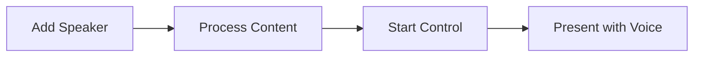

# User Guide

## Table of Contents

1. [Getting Started](#getting-started)
2. [Speaker Management](#speaker-management)
3. [Processing Content](#processing-content)
4. [Live Presentation Control](#live-presentation-control)
5. [Settings Configuration](#settings-configuration)
6. [Advanced Usage](#advanced-usage)
7. [Best Practices](#best-practices)

## Getting Started

### Prerequisites

Before using Moves, ensure you have:
- ✅ Completed [installation](./installation.md)
- ✅ Configured your LLM provider and API key
- ✅ A microphone connected and working
- ✅ PDF files for your presentation and transcript

### Basic Workflow

The typical Moves workflow follows these steps:



1. **Add Speaker**: Register a speaker profile with presentation and transcript files
2. **Process Content**: Use AI to generate synchronized sections  
3. **Start Control**: Begin voice-controlled presentation mode
4. **Present with Voice**: Speak naturally and let Moves navigate slides

## Speaker Management

### Adding a New Speaker

Create a speaker profile with your presentation materials:

```bash
# Basic syntax
python app.py speaker add "<speaker_name>" <presentation.pdf> <transcript.pdf>

# Example
python app.py speaker add "John Smith" ~/presentations/keynote.pdf ~/transcripts/speech.pdf
```

**File Requirements:**
- **Presentation PDF**: Your slide deck in PDF format
- **Transcript PDF**: Written version of your speech in PDF format

### Viewing Speakers

List all registered speakers:

```bash
python app.py speaker list
```

Output example:
```
Registered Speakers (2)

ID              NAME    STATUS
─────────────── ──────  ──────────
john_smith_a1b2 John    Ready
jane_doe_c3d4   Jane    Not Ready
```

**Status Meanings:**
- **Ready**: Speaker has been processed and is ready for live control
- **Not Ready**: Speaker needs to be processed first

### Speaker Details

View detailed information about a specific speaker:

```bash
# Using speaker name
python app.py speaker show "John Smith"

# Using speaker ID  
python app.py speaker show john_smith_a1b2
```

### Updating Speaker Files

Modify a speaker's presentation or transcript files:

```bash
# Update presentation only
python app.py speaker edit "John Smith" --presentation ~/new_presentation.pdf

# Update transcript only
python app.py speaker edit "John Smith" --transcript ~/new_transcript.pdf

# Update both files
python app.py speaker edit "John Smith" -p ~/new_slides.pdf -t ~/new_script.pdf
```

**Note**: After updating files, you must re-process the speaker.

### Removing Speakers

Delete a speaker and all associated data:

```bash
python app.py speaker delete "John Smith"
```

⚠️ **Warning**: This permanently removes all speaker data including processed sections.

## Processing Content

### Understanding Content Processing

Processing converts your raw presentation and transcript files into synchronized sections that Moves can use for voice navigation. This step:

1. **Extracts text** from both PDF files
2. **Sends content to LLM** for intelligent alignment  
3. **Generates sections** that match slides to transcript segments
4. **Stores results** locally for fast access during presentations

### Processing Single Speaker

```bash
# Process one specific speaker
python app.py speaker process "John Smith"
```

### Processing Multiple Speakers

```bash
# Process multiple speakers at once
python app.py speaker process "John Smith" "Jane Doe" "Bob Wilson"

# Process all speakers
python app.py speaker process --all
```

### Processing Output

Successful processing shows:
```
Speaker 'John Smith' (john_smith_a1b2) processed.
    24 sections created.
```

### What Happens During Processing

1. **PDF Text Extraction**: 
   - Presentation: Each slide becomes a numbered section
   - Transcript: Continuous text extraction

2. **LLM Content Alignment**:
   - Analyzes slide content and transcript together
   - Creates one text segment per slide
   - Matches slide topics to transcript portions
   - Handles language differences and formatting issues

3. **Section Generation**:
   - Produces JSON file with synchronized sections
   - Each section contains content and index number
   - Optimized for real-time similarity matching

### Processing Requirements

- **Internet Connection**: Required for LLM API calls
- **API Key**: Must be configured for your chosen provider
- **Valid PDFs**: Both files must be readable PDF documents
- **LLM Credits**: Processing consumes API tokens/credits

## Live Presentation Control

### Starting Control Mode

Begin voice-controlled presentation:

```bash
python app.py presentation control "John Smith"
```

### Control Interface

When control starts, you'll see:

```
Starting presentation control for 'John Smith' (john_smith_a1b2).
    24 sections loaded
    READY & LISTENING

    Press Ctrl+C to exit.
    
Keyboard controls:
      → (Right Arrow): Next section
      ← (Left Arrow): Previous section  
      Ins (Insert): Pause/Resume automatic navigation
    
Waiting for 12 words to first trigger, keep speaking...
```

### How Voice Control Works

1. **Voice Recognition**: Continuously listens to your microphone
2. **Word Buffering**: Maintains a sliding window of recent words (default: 12 words)
3. **Similarity Matching**: Compares your speech against expected content
4. **Automatic Navigation**: Triggers slide advancement when content matches

### Control Modes

#### Automatic Mode (Default)
- Moves advances slides automatically based on voice content
- Navigate forward and backward as you speak
- Seamless integration with your natural speech pattern

#### Manual Override
- **Right Arrow (→)**: Force advance to next section
- **Left Arrow (←)**: Force go back to previous section
- **Insert Key**: Pause/resume automatic navigation

#### Paused Mode
- Press **Insert** to pause automatic navigation
- Manual keyboard controls still work
- Press **Insert** again to resume automatic mode

### Voice Control Tips

**For Best Results:**
- Speak clearly and at normal pace
- Use natural speech patterns
- Don't pause too long between key content
- Position microphone appropriately

**Technical Notes:**
- System needs ~12 words to start matching
- Recognition works in real-time with low latency
- Both semantic meaning and phonetic sounds are considered
- Handles speech-to-text errors gracefully

### Stopping Control

Exit presentation control:
- Press **Ctrl+C** to stop gracefully
- System will clean up resources and exit

## Settings Configuration

### Viewing Current Settings

```bash
python app.py settings list
```

Output:
```
Application Settings.
    model (LLM Model) -> openai/gpt-4
    key (API Key) -> sk-your-key-here
```

### Configuring LLM Model

Set your preferred language model:

```bash
# OpenAI Models
python app.py settings set model "openai/gpt-4"
python app.py settings set model "openai/gpt-3.5-turbo"

# Anthropic Models  
python app.py settings set model "anthropic/claude-3-sonnet"
python app.py settings set model "anthropic/claude-3-haiku"

# Google Models
python app.py settings set model "gemini/gemini-2.0-flash"
python app.py settings set model "gemini/gemini-pro"

# Other Providers (via LiteLLM)
python app.py settings set model "azure/gpt-4"
python app.py settings set model "bedrock/claude-3-sonnet"
```

### Setting API Keys

Configure authentication for your chosen provider:

```bash
# Set API key
python app.py settings set key "your-api-key-here"
```

### Resetting Settings

Reset settings to default values:

```bash
# Reset model to default
python app.py settings unset model

# Reset API key  
python app.py settings unset key
```

Default values:
- **Model**: `gemini/gemini-2.0-flash`
- **Key**: Not configured

## Advanced Usage

### Multi-Speaker Presentations

For presentations with multiple speakers:

1. Create separate speaker profiles for each presenter
2. Process each speaker individually  
3. Switch between speakers during presentation:

```bash
# Stop current control (Ctrl+C)
# Start control for different speaker
python app.py presentation control "Speaker 2"
```

### Custom Window Sizes

The system uses a sliding window of words for matching. Default is 12 words, but you can modify this programmatically:

```python
# In presentation_controller_instance() function
return PresentationController(
    sections=sections,
    start_section=start_section,
    window_size=16,  # Increase for longer context
)
```

### Batch Operations

Process multiple speakers efficiently:

```bash
# Add multiple speakers
python app.py speaker add "Speaker 1" pres1.pdf trans1.pdf
python app.py speaker add "Speaker 2" pres2.pdf trans2.pdf  
python app.py speaker add "Speaker 3" pres3.pdf trans3.pdf

# Process all at once
python app.py speaker process --all
```

### Integration with Presentation Software

Moves uses keyboard simulation to control slides. Ensure your presentation software:

- **Accepts arrow key navigation** (PowerPoint, Keynote, Google Slides all work)
- **Is in fullscreen/presentation mode** when you start control
- **Has focus** (is the active window)

### Custom LLM Instructions

The system uses predefined instructions for content processing. Advanced users can modify:

`src/data/llm_instruction.md` - Contains the prompt template sent to LLM

## Best Practices

### Content Preparation

#### Presentation PDFs
- **Clean slides**: Remove excessive formatting, focus on key content
- **Readable text**: Avoid images-only slides  
- **Logical order**: Ensure slides follow presentation sequence
- **Consistent format**: Use standard slide layouts

#### Transcript PDFs
- **Complete content**: Include all spoken material
- **Natural language**: Write as you plan to speak
- **Matching language**: Use same language as your presentation
- **Proper formatting**: Clean, readable text without excessive formatting

### Recording and Speech

#### Microphone Setup
- **Quality microphone**: Use a decent microphone for better recognition
- **Proper positioning**: 6-12 inches from your mouth
- **Noise reduction**: Minimize background noise
- **Consistent volume**: Maintain steady speaking volume

#### Speaking Techniques
- **Natural pace**: Don't speak too fast or too slow
- **Clear articulation**: Pronounce words clearly
- **Key phrases**: Include important slide keywords in your speech
- **Smooth transitions**: Connect sections naturally

### Performance Optimization

#### System Performance
- **Close unnecessary apps**: Free up CPU and memory
- **Stable internet**: Ensure good connection for initial processing
- **Adequate resources**: Meet recommended hardware requirements

#### Recognition Accuracy
- **Practice runs**: Test system with your content before live presentation
- **Backup plan**: Be ready to use manual controls if needed
- **Content alignment**: Ensure transcript matches actual speech patterns

### Presentation Environment

#### Room Setup
- **Quiet environment**: Minimize background noise and interruptions
- **Microphone positioning**: Set up mic before starting
- **Display setup**: Ensure presentation display is ready
- **Backup controls**: Keep manual remote handy

#### Live Presentation
- **Start early**: Begin control mode before audience arrives
- **Natural speaking**: Don't change your speaking style for the system
- **Monitor feedback**: Watch for correct slide transitions
- **Graceful fallback**: Use manual controls if needed

### Troubleshooting During Use

#### If Voice Control Stops Working
1. Check microphone connection
2. Verify system isn't paused (Insert key)
3. Use manual arrow keys temporarily
4. Restart control mode if necessary

#### If Slides Don't Match Speech
1. Speak more clearly
2. Include key slide content in your speech
3. Use manual controls for problematic sections
4. Consider reprocessing content with better transcript

#### If System Performance Degrades
1. Close other applications
2. Check system resources
3. Reduce window size if possible
4. Restart the application

This comprehensive user guide covers all aspects of using Moves effectively. For technical details, see the [Core Components](./core-components.md) documentation, and for troubleshooting specific issues, consult the [Troubleshooting Guide](./troubleshooting.md).